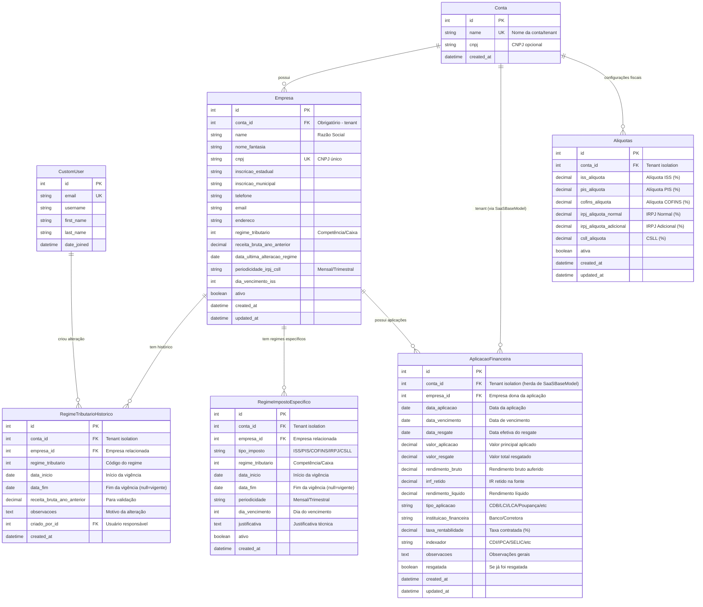
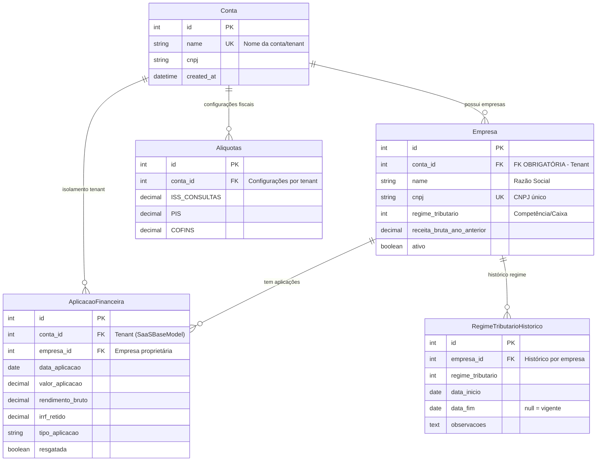
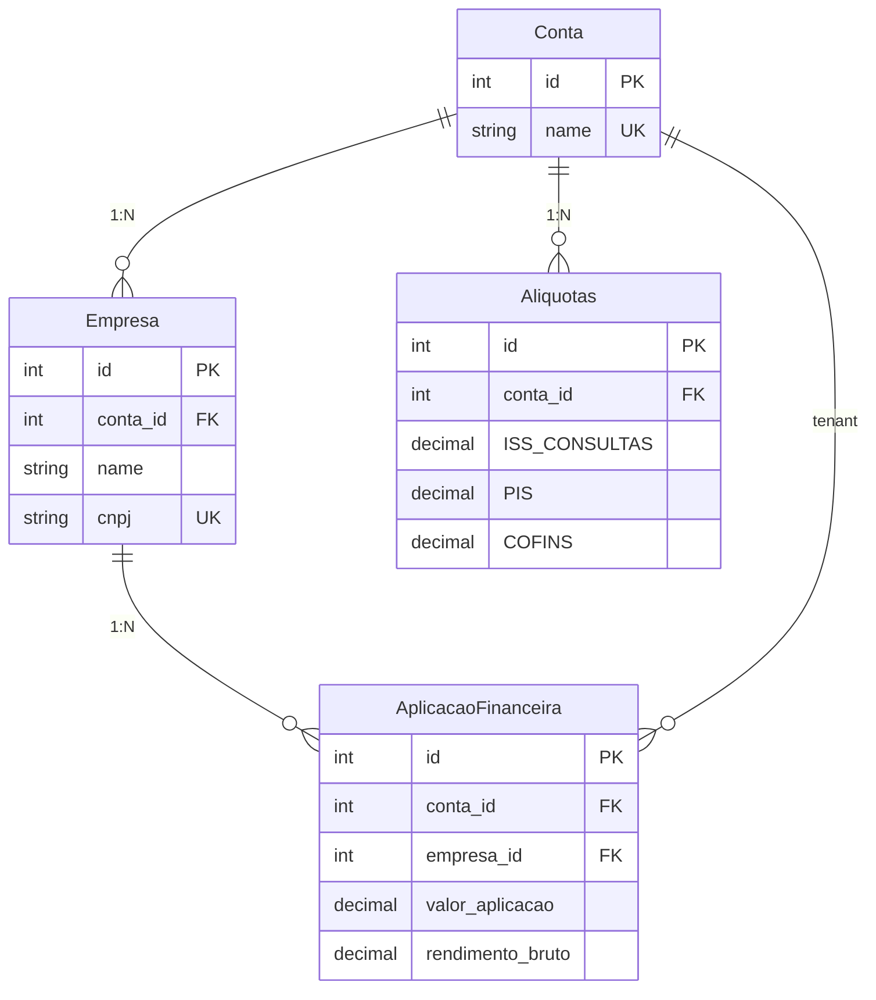

# DIAGRAMA ER - MODELOS DE APLICAÇÕES FINANCEIRAS E FISCAIS

## Versão Final: Incluindo Relacionamento Conta-Empresa

Este diagrama mostra a estrutura completa dos modelos de aplicações financeiras, fiscais e seus relacionamentos no sistema Django, com especial foco no relacionamento entre `Conta` e `Empresa`.

## 🔗 **Links para Visualização Gráfica**

### 📊 **Visualizadores Online de Mermaid**

1. **Mermaid Live Editor** (Recomendado)
   - 🔗 https://mermaid.live/
   - ✅ Copie o código Mermaid abaixo e cole no editor
   - ✅ Suporte completo a diagramas ER
   - ✅ Exportação em PNG, SVG, PDF

2. **Mermaid Chart**
   - 🔗 https://www.mermaidchart.com/
   - ✅ Editor avançado com colaboração
   - ✅ Múltiplos formatos de exportação

3. **GitHub/GitLab** (Se estiver usando repositório)
   - ✅ Visualização automática em arquivos `.md`
   - ✅ Renderização nativa do Mermaid

### 💡 **Como Usar**
1. Acesse um dos links acima
2. Copie o código Mermaid dos diagramas abaixo
3. Cole no editor online
4. Visualize o diagrama renderizado
5. Exporte se necessário (PNG, SVG, PDF)

---



## Análise dos Relacionamentos

### 🏢 **Relacionamento Central: Conta ↔ Empresa**
- **Tipo**: One-to-Many (1:N)
- **Definição**: `Empresa.conta = ForeignKey(Conta, related_name='empresas')`
- **Significado**: Uma conta (tenant) pode ter múltiplas empresas
- **Isolamento**: Garante separação multi-tenant dos dados

### 💰 **Aplicações Financeiras**
- **Relação com Empresa**: `AplicacaoFinanceira.empresa = ForeignKey(Empresa)`
- **Relação com Conta**: Via herança de `SaaSBaseModel` (tenant isolation)
- **Duplo controle**: Empresa específica + isolamento por conta

### 🏛️ **Modelos Fiscais**
- **RegimeTributarioHistorico**: Vinculado a empresa específica
- **RegimeImpostoEspecifico**: Configurações por empresa e imposto
- **Aliquotas**: Configurações globais por conta (tenant)

### 🔐 **Isolamento Multi-Tenant**
- Todos os modelos possuem `conta_id` (direta ou indiretamente)
- `SaaSBaseModel` fornece isolamento automático
- Constraints garantem unicidade por tenant

## Características Técnicas

### ✅ **Validações e Regras de Negócio**
- Regime de caixa limitado por receita (R$ 78 milhões)
- Alterações de regime apenas anuais
- Validação de datas de vigência
- Controle de periodicidade por tipo de imposto

### ✅ **Auditoria e Rastreabilidade**
- Campos de criação e atualização
- Histórico de alterações de regime
- Usuário responsável por mudanças

### ✅ **Integração Tributária**
- Métodos para cálculo de impostos nas aplicações
- Obtenção de regime vigente por data
- Configurações específicas por tipo de imposto

## Notas de Implementação

1. **Relacionamento Conta-Empresa**: Implementado como FK direta, garantindo que cada empresa pertence a uma única conta
2. **Aplicações Financeiras**: Herdam isolamento via `SaaSBaseModel` e se relacionam diretamente com a empresa
3. **Modelos Fiscais**: Conectados à empresa para configurações específicas e à conta para isolamento
4. **Validações**: Implementadas nos modelos com regras da legislação brasileira

## Diagrama ER Simplificado - Relacionamento Conta-Empresa

Este diagrama simplificado destaca o relacionamento central entre `Conta` e `Empresa` e sua integração com os modelos fiscais e de aplicações financeiras:



### 📊 **Diagrama Ultra-Simplificado - Relacionamentos Essenciais**



### 🎯 **Resumo dos Relacionamentos**

| **Origem** | **Destino** | **Tipo** | **Significado** |
|------------|-------------|----------|-----------------|
| **Conta** | **Empresa** | 1:N | Uma conta pode ter várias empresas |
| **Empresa** | **AplicacaoFinanceira** | 1:N | Uma empresa pode ter várias aplicações |
| **Conta** | **Aliquotas** | 1:N | Uma conta pode ter várias configurações de alíquotas |
| **Conta** | **AplicacaoFinanceira** | 1:N | Isolamento multi-tenant (via SaaSBaseModel) |

### ✅ **Validação do Design**
- ✅ **Multi-tenancy**: Todos os dados isolados por `Conta`
- ✅ **Segregação**: Empresas como entidades independentes dentro do tenant
- ✅ **Flexibilidade**: Configurações fiscais por conta, regime por empresa
- ✅ **Rastreabilidade**: Aplicações vinculadas tanto à conta quanto à empresa

## 📋 **Códigos Mermaid para Copiar**

### 🎯 **Diagrama Completo** (Para análise detalhada)
```text
erDiagram
    CustomUser {
        int id PK
        string email UK
        string username
        string first_name
        string last_name
        datetime date_joined
    }
    Conta {
        int id PK
        string name UK "Nome da conta/tenant"
        string cnpj "CNPJ opcional"
        datetime created_at
    }
    Empresa {
        int id PK
        int conta_id FK "Obrigatório - tenant"
        string name "Razão Social"
        string nome_fantasia
        string cnpj UK "CNPJ único"
        string inscricao_estadual
        string inscricao_municipal
        string telefone
        string email
        string endereco
        int regime_tributario "Competência/Caixa"
        decimal receita_bruta_ano_anterior
        date data_ultima_alteracao_regime
        string periodicidade_irpj_csll "Mensal/Trimestral"
        int dia_vencimento_iss
        boolean ativo
        datetime created_at
        datetime updated_at
    }
    Aliquotas {
        int id PK
        int conta_id FK "Tenant isolation"
        decimal iss_aliquota "Alíquota ISS (%)"
        decimal pis_aliquota "Alíquota PIS (%)"
        decimal cofins_aliquota "Alíquota COFINS (%)"
        decimal irpj_aliquota_normal "IRPJ Normal (%)"
        decimal irpj_aliquota_adicional "IRPJ Adicional (%)"
        decimal csll_aliquota "CSLL (%)"
        boolean ativa
        datetime created_at
        datetime updated_at
    }
    RegimeTributarioHistorico {
        int id PK
        int conta_id FK "Tenant isolation"
        int empresa_id FK "Empresa relacionada"
        int regime_tributario "Código do regime"
        date data_inicio "Início da vigência"
        date data_fim "Fim da vigência (null=vigente)"
        decimal receita_bruta_ano_anterior "Para validação"
        text observacoes "Motivo da alteração"
        int criado_por_id FK "Usuário responsável"
        datetime created_at
    }
    RegimeImpostoEspecifico {
        int id PK
        int conta_id FK "Tenant isolation"
        int empresa_id FK "Empresa relacionada"
        string tipo_imposto "ISS/PIS/COFINS/IRPJ/CSLL"
        int regime_tributario "Competência/Caixa"
        date data_inicio "Início da vigência"
        date data_fim "Fim da vigência (null=vigente)"
        string periodicidade "Mensal/Trimestral"
        int dia_vencimento "Dia do vencimento"
        text justificativa "Justificativa técnica"
        boolean ativo
        datetime created_at
    }
    AplicacaoFinanceira {
        int id PK
        int conta_id FK "Tenant isolation (herda de SaaSBaseModel)"
        int empresa_id FK "Empresa dona da aplicação"
        date data_aplicacao "Data da aplicação"
        date data_vencimento "Data de vencimento"
        date data_resgate "Data efetiva do resgate"
        decimal valor_aplicacao "Valor principal aplicado"
        decimal valor_resgate "Valor total resgatado"
        decimal rendimento_bruto "Rendimento bruto auferido"
        decimal irrf_retido "IR retido na fonte"
        decimal rendimento_liquido "Rendimento líquido"
        string tipo_aplicacao "CDB/LCI/LCA/Poupança/etc"
        string instituicao_financeira "Banco/Corretora"
        decimal taxa_rentabilidade "Taxa contratada (%)"
        string indexador "CDI/IPCA/SELIC/etc"
        text observacoes "Observações gerais"
        boolean resgatada "Se já foi resgatada"
        datetime created_at
        datetime updated_at
    }
    Conta ||--o{ Empresa : "possui"
    Empresa ||--o{ RegimeTributarioHistorico : "tem histórico"
    Empresa ||--o{ RegimeImpostoEspecifico : "tem regimes específicos"
    Empresa ||--o{ AplicacaoFinanceira : "possui aplicações"
    Conta ||--o{ AplicacaoFinanceira : "tenant (via SaaSBaseModel)"
    Conta ||--o{ Aliquotas : "configurações fiscais"
    CustomUser ||--o{ RegimeTributarioHistorico : "criou alteração"
```

### ⚡ **Diagrama Ultra-Simplificado** (Para apresentações)
```text
erDiagram
    Conta {
        int id PK
        string name UK
    }
    Empresa {
        int id PK
        int conta_id FK
        string name
        string cnpj UK
    }
    AplicacaoFinanceira {
        int id PK
        int conta_id FK
        int empresa_id FK
        decimal valor_aplicacao
        decimal rendimento_bruto
    }
    Aliquotas {
        int id PK  
        int conta_id FK
        decimal ISS_CONSULTAS
        decimal PIS
        decimal COFINS
    }
    Conta ||--o{ Empresa : "1:N"
    Empresa ||--o{ AplicacaoFinanceira : "1:N"
    Conta ||--o{ Aliquotas : "1:N"
    Conta ||--o{ AplicacaoFinanceira : "tenant"
```

### 💡 **Método Mais Simples (Passo a Passo)**

#### **🚀 Copiar e Visualizar em 30 segundos:**
1. **Abra uma nova aba**: https://mermaid.live/
2. **Limpe o editor** (Ctrl+A, Delete)
3. **Copie ESTE código completo** (da seção "Diagrama Completo" abaixo):

```text
erDiagram
    CustomUser {
        int id PK
        string email UK
        string username
        string first_name
        string last_name
        datetime date_joined
    }
    Conta {
        int id PK
        string name UK "Nome da conta/tenant"
        string cnpj "CNPJ opcional"
        datetime created_at
    }
    Empresa {
        int id PK
        int conta_id FK "Obrigatório - tenant"
        string name "Razão Social"
        string nome_fantasia
        string cnpj UK "CNPJ único"
        string inscricao_estadual
        string inscricao_municipal
        string telefone
        string email
        string endereco
        int regime_tributario "Competência/Caixa"
        decimal receita_bruta_ano_anterior
        date data_ultima_alteracao_regime
        string periodicidade_irpj_csll "Mensal/Trimestral"
        int dia_vencimento_iss
        boolean ativo
        datetime created_at
        datetime updated_at
    }
    Aliquotas {
        int id PK
        int conta_id FK "Tenant isolation"
        decimal iss_aliquota "Alíquota ISS (%)"
        decimal pis_aliquota "Alíquota PIS (%)"
        decimal cofins_aliquota "Alíquota COFINS (%)"
        decimal irpj_aliquota_normal "IRPJ Normal (%)"
        decimal irpj_aliquota_adicional "IRPJ Adicional (%)"
        decimal csll_aliquota "CSLL (%)"
        boolean ativa
        datetime created_at
        datetime updated_at
    }
    RegimeTributarioHistorico {
        int id PK
        int conta_id FK "Tenant isolation"
        int empresa_id FK "Empresa relacionada"
        int regime_tributario "Código do regime"
        date data_inicio "Início da vigência"
        date data_fim "Fim da vigência (null=vigente)"
        decimal receita_bruta_ano_anterior "Para validação"
        text observacoes "Motivo da alteração"
        int criado_por_id FK "Usuário responsável"
        datetime created_at
    }
    RegimeImpostoEspecifico {
        int id PK
        int conta_id FK "Tenant isolation"
        int empresa_id FK "Empresa relacionada"
        string tipo_imposto "ISS/PIS/COFINS/IRPJ/CSLL"
        int regime_tributario "Competência/Caixa"
        date data_inicio "Início da vigência"
        date data_fim "Fim da vigência (null=vigente)"
        string periodicidade "Mensal/Trimestral"
        int dia_vencimento "Dia do vencimento"
        text justificativa "Justificativa técnica"
        boolean ativo
        datetime created_at
    }
    AplicacaoFinanceira {
        int id PK
        int conta_id FK "Tenant isolation (herda de SaaSBaseModel)"
        int empresa_id FK "Empresa dona da aplicação"
        date data_aplicacao "Data da aplicação"
        date data_vencimento "Data de vencimento"
        date data_resgate "Data efetiva do resgate"
        decimal valor_aplicacao "Valor principal aplicado"
        decimal valor_resgate "Valor total resgatado"
        decimal rendimento_bruto "Rendimento bruto auferido"
        decimal irrf_retido "IR retido na fonte"
        decimal rendimento_liquido "Rendimento líquido"
        string tipo_aplicacao "CDB/LCI/LCA/Poupança/etc"
        string instituicao_financeira "Banco/Corretora"
        decimal taxa_rentabilidade "Taxa contratada (%)"
        string indexador "CDI/IPCA/SELIC/etc"
        text observacoes "Observações gerais"
        boolean resgatada "Se já foi resgatada"
        datetime created_at
        datetime updated_at
    }
    Conta ||--o{ Empresa : "possui"
    Empresa ||--o{ RegimeTributarioHistorico : "tem histórico"
    Empresa ||--o{ RegimeImpostoEspecifico : "tem regimes específicos"
    Empresa ||--o{ AplicacaoFinanceira : "possui aplicações"
    Conta ||--o{ AplicacaoFinanceira : "tenant (via SaaSBaseModel)"
    Conta ||--o{ Aliquotas : "configurações fiscais"
    CustomUser ||--o{ RegimeTributarioHistorico : "criou alteração"
```

4. **Cole no editor** do Mermaid Live
5. **O diagrama aparece automaticamente!**

### 🐙 **Se estiver no GitHub:**
- ✅ O arquivo `.md` com Mermaid é renderizado automaticamente
- ✅ Não precisa de ferramentas externas
- ✅ Visualização direta no navegador

---

### 🔑 **Pontos-Chave do Relacionamento**

#### **1. Relacionamento Central: Conta ↔ Empresa**
```python
# Em models/base.py
class Empresa(models.Model):
    conta = models.ForeignKey(
        Conta, 
        on_delete=models.CASCADE, 
        related_name='empresas',  # Uma conta TEM VÁRIAS empresas
        null=False                # Relacionamento OBRIGATÓRIO
    )
```

#### **2. Fluxo de Dados Multi-Tenant**
```
Conta (Tenant)
    ↓ (1:N)
Empresa (Entidade de Negócio)
    ↓ (1:N)
AplicacaoFinanceira (Transações)
```

#### **3. Duplo Controle de Isolamento**
- **Nível 1**: `Conta` (tenant isolation)
- **Nível 2**: `Empresa` (segregação de negócio)

#### **4. Configurações Fiscais**
- **Alíquotas**: Por conta (configuração global do tenant)
- **Regime Tributário**: Por empresa (específico de cada entidade)
