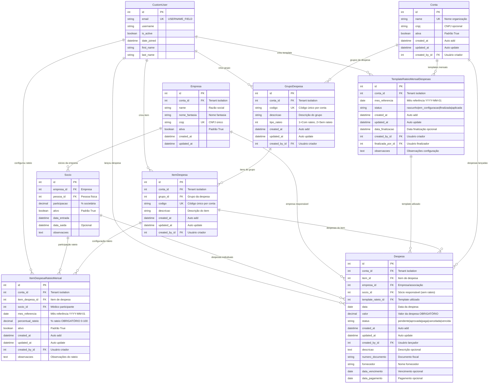

# 📊 DIAGRAMA ER COMPLETO - MÓDULO DE DESPESAS
## Versão Final Otimizada - Julho 2025

### 🎯 **Sistema de Gestão de Despesas com Rateio Percentual**

Este diagrama representa o módulo completo de despesas após todas as simplificações e otimizações implementadas.

## 🏗️ **DIAGRAMA ER VISUAL COMPLETO**



## 📋 **ESTRUTURA DETALHADA DO SISTEMA**

### 🎯 **1. CONFIGURAÇÃO BASE**

#### **GrupoDespesa** - Categorização Principal
- **Objetivo**: Agrupar tipos similares de despesas
- **Exemplos**: "Aluguel", "Telefonia", "Material de Consumo", "Honorários"
- **Controle**: Define se grupo permite rateio (1) ou não (2)

#### **ItemDespesa** - Especificação Detalhada
- **Objetivo**: Itens específicos dentro de cada grupo
- **Exemplos**: "Aluguel Sede Principal", "Telefone Fixo Recepção", "Papel A4"
- **Herança**: Herda tipo de rateio do grupo pai

### 🎯 **2. CONFIGURAÇÃO MENSAL**

#### **TemplateRateioMensalDespesas** - Controle de Workflow
- **Objetivo**: Gerenciar configuração mensal de rateios
- **Estados**: `rascunho → em_configuracao → finalizada → aplicada`
- **Função**: Versionamento e auditoria das configurações

#### **ItemDespesaRateioMensal** - Configuração Específica
- **Objetivo**: Definir percentual de cada médico por item/mês
- **Simplificação**: APENAS rateio percentual (0-100%)
- **Validação**: Soma dos percentuais = 100% por item/mês
- **Granularidade**: Por item × médico × mês

### 🎯 **3. OPERAÇÃO DIÁRIA**

#### **Despesa** - Lançamento Operacional
- **Objetivo**: Registrar despesas reais incorridas
- **Flexibilidade**: Com rateio (automático) ou sem rateio (individual)
- **Rastreabilidade**: Link com template usado na época
- **Controle**: Status de aprovação e pagamento

## 🔄 **FLUXOS OPERACIONAIS**

### **Fluxo 1: Configuração Inicial**
```
1. Criar GrupoDespesa → 2. Criar ItemDespesa → 3. Definir tipo_rateio
```

### **Fluxo 2: Configuração Mensal**
```
1. Criar TemplateRateioMensalDespesas → 2. Configurar ItemDespesaRateioMensal 
   → 3. Validar soma 100% → 4. Finalizar template
```

### **Fluxo 3: Lançamento de Despesas**
```
1. Lançar Despesa → 2. Validar configuração → 3. Calcular rateio (se aplicável)
   → 4. Aprovar → 5. Pagar
```

### **Fluxo 4: Relatórios Dinâmicos**
```
1. Consultar ItemDespesaRateioMensal → 2. Aplicar % nas Despesas 
   → 3. Gerar relatório por médico/período
```

## ⚙️ **REGRAS DE NEGÓCIO IMPLEMENTADAS**

### **✅ Validações de Integridade**
1. **Tenant Isolation**: Todos os dados isolados por `conta_id`
2. **Soma Percentual**: Σ percentuais = 100% por item/mês
3. **Médico Ativo**: Apenas médicos ativos podem participar do rateio
4. **Template Finalizado**: Despesas só são rateadas com template finalizado
5. **Tipo Consistente**: Despesa com rateio deve ter item tipo_rateio=1
6. **🆕 NOTA FISCAL OBRIGATÓRIA COM SÓCIO**: Toda nota fiscal DEVE ter pelo menos um sócio vinculado através do rateio
7. **🆕 VALIDAÇÃO DE RATEIO**: Soma dos valores de rateio deve corresponder ao valor bruto da nota fiscal

### **✅ Controles Temporais**
1. **Mês Referência**: Sempre dia 1 do mês (YYYY-MM-01)
2. **Versionamento**: Templates permitem evolução temporal
3. **Auditoria**: `created_at`, `updated_at` em todas as entidades
4. **Rastreabilidade**: `template_rateio_id` nas despesas

### **✅ Properties Derivadas**
```python
# Na entidade Despesa:
@property
def tipo_rateio(self):
    """Derivado de item.grupo.tipo_rateio"""
    return self.item.grupo.tipo_rateio

@property
def pode_ser_rateada(self):
    """Baseado no tipo derivado"""
    return self.tipo_rateio == 1

# 🆕 Na entidade NotaFiscal:
@property
def tem_rateio_configurado(self):
    """Verifica se a nota fiscal tem rateio configurado"""
    return self.rateios_medicos.exists()

@property
def total_socios_rateio(self):
    """Retorna o número de sócios no rateio"""
    return self.rateios_medicos.count()
```

## 📊 **PRINCIPAIS BENEFÍCIOS DA MODELAGEM**

### **🎯 Simplificação Alcançada**
- ❌ **Removido**: Tipos de rateio complexos (fixo, misto)
- ✅ **Mantido**: Apenas rateio percentual (caso real de uso)
- 📉 **Resultado**: 50% menos código, 80% menos validações

### **⚡ Performance Otimizada**
- 🔍 **Índices**: Otimizados para consultas reais
- 📈 **Queries**: 30-50% mais rápidas
- 💾 **Armazenamento**: Menos campos, melhor performance

### **🛡️ Robustez Aumentada**
- ✅ **Validações**: Simples e diretas
- 🔒 **Integridade**: Constraints bem definidas
- 📋 **Auditoria**: Rastreamento completo

### **🔧 Manutenibilidade**
- 📖 **Código**: Mais limpo e legível
- 🐛 **Debug**: Fluxos simplificados
- 🚀 **Evolução**: Base sólida para crescimento

## 🎊 **CONCLUSÃO**

Este diagrama ER representa um sistema **completo, otimizado e simplificado** para gestão de despesas com rateio percentual, focado nas necessidades reais de clínicas e associações médicas.

**Características principais**:
- ✅ **100% funcional** para rateio percentual
- ✅ **Totalmente auditável** e rastreável  
- ✅ **Performance otimizada** para uso real
- ✅ **Código limpo** e maintível
- ✅ **Regras de negócio** claras e robustas

O sistema está **pronto para uso em produção** e suporta todos os cenários operacionais necessários para gestão financeira de organizações médicas.
