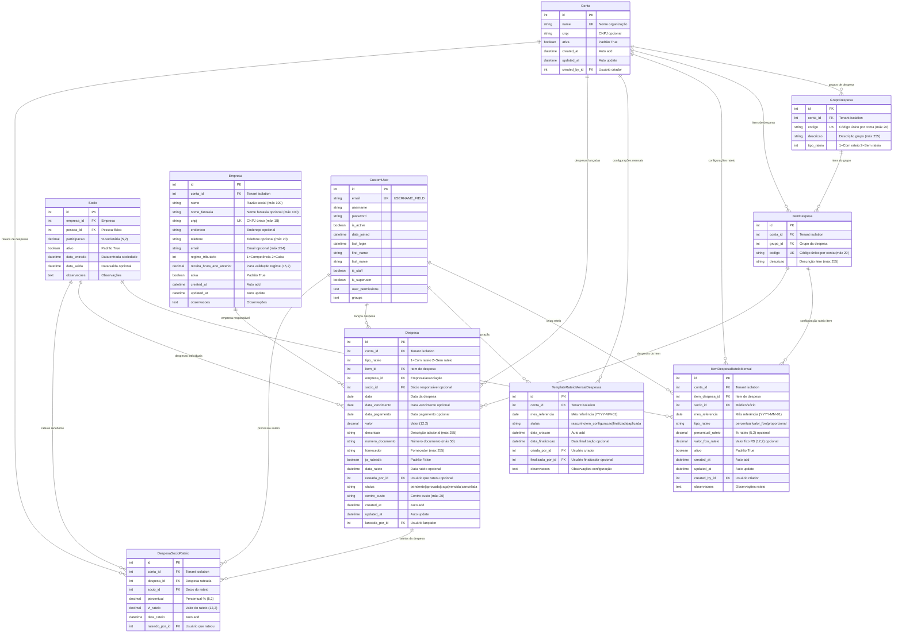

# Diagrama ER - Módulo de Despesas e Rateio

## Data: Janeiro 2025 - BASEADO NO CÓDIGO REAL IMPLEMENTADO

Este diagrama representa especificamente o módulo de despesas e sistema de rateio, extraído da análise detalhada dos modelos Django implementados.



## 📋 **Análise do Módulo de Despesas**

### 🏗️ **Arquitetura do Sistema de Despesas**

#### **1. Estrutura Hierárquica**:
```
Conta (Tenant)
└── GrupoDespesa (Agrupamento)
    └── ItemDespesa (Categoria específica)
        ├── ItemDespesaRateioMensal (Configuração rateio)
        └── Despesa (Lançamento real)
            └── DespesaSocioRateio (Distribuição)
```

#### **2. Fluxo de Trabalho**:
1. **Configuração**: Criação de grupos e itens de despesa
2. **Template Mensal**: Configuração dos percentuais de rateio por mês
3. **Lançamento**: Registro da despesa real
4. **Rateio**: Distribuição automática ou manual entre sócios
5. **Auditoria**: Rastreamento completo das operações

### ⚙️ **Funcionalidades Implementadas**

#### **1. Sistema de Rateio Flexível**:
- **Por Percentual**: Distribuição proporcional configurável
- **Por Valor Fixo**: Valores específicos por sócio
- **Proporcional**: Baseado em critérios configuráveis
- **Controle Temporal**: Configuração mensal independente

#### **2. Tipos de Despesa**:
- **Com Rateio**: Distribuída entre múltiplos sócios
- **Sem Rateio**: Atribuída a um sócio específico
- **Flexibilidade**: Mudança de tipo conforme necessidade

#### **3. Controles de Status**:
- **Despesa**: `pendente|aprovada|paga|vencida|cancelada`
- **Template**: `rascunho|em_configuracao|finalizada|aplicada`
- **Rateio**: Controle de execução (`ja_rateada`)

#### **4. Auditoria Completa**:
- **Criação**: Usuário e data de todos os registros
- **Modificação**: Controle de alterações
- **Rateio**: Usuário e data do processamento
- **Rastreabilidade**: Histórico completo de operações

### 🔄 **Relacionamentos e Dependências**

#### **1. Dependências Principais**:
- **Conta**: Tenant isolation (todos os modelos)
- **Empresa**: Organização responsável pela despesa
- **Socio**: Participantes do rateio
- **CustomUser**: Auditoria e controle de acesso

#### **2. Relacionamentos Internos**:
- **GrupoDespesa → ItemDespesa**: Um-para-muitos
- **ItemDespesa → Despesa**: Um-para-muitos
- **Despesa → DespesaSocioRateio**: Um-para-muitos
- **ItemDespesa → ItemDespesaRateioMensal**: Um-para-muitos

#### **3. Validações Críticas**:
- **Percentuais**: Soma dos rateios = 100%
- **Valores**: Não negativos, coerência entre total e rateios
- **Temporais**: Mês de referência consistente
- **Status**: Transições válidas entre estados

### 💰 **Gestão Financeira**

#### **1. Campos Monetários**:
- **Despesa.valor**: Valor total da despesa (12,2)
- **ItemDespesaRateioMensal.valor_fixo_rateio**: Valor fixo (12,2)
- **DespesaSocioRateio.vl_rateio**: Valor do rateio (12,2)

#### **2. Campos Percentuais**:
- **ItemDespesaRateioMensal.percentual_rateio**: % rateio (5,2)
- **DespesaSocioRateio.percentual**: % do rateio (5,2)

#### **3. Cálculos Automatizados**:
- **Rateio por percentual**: `valor_despesa * percentual / 100`
- **Validação**: Soma dos percentuais = 100%
- **Controle**: Soma dos valores = valor total

### 📅 **Controle Temporal**

#### **1. Configuração Mensal**:
- **ItemDespesaRateioMensal.mes_referencia**: YYYY-MM-01
- **TemplateRateioMensalDespesas.mes_referencia**: YYYY-MM-01
- **Flexibilidade**: Percentuais diferentes por mês

#### **2. Datas de Despesa**:
- **data**: Data da despesa (obrigatória)
- **data_vencimento**: Vencimento opcional
- **data_pagamento**: Pagamento opcional
- **data_rateio**: Data do processamento do rateio

#### **3. Auditoria Temporal**:
- **created_at/updated_at**: Automáticos em todos os modelos
- **data_criacao/data_finalizacao**: Template de rateio
- **Histórico**: Preservação de alterações

### 🎯 **Casos de Uso Principais**

#### **1. Configuração Inicial**:
```
1. Criar GrupoDespesa (ex: "Administrativas")
2. Criar ItemDespesa (ex: "Energia Elétrica")
3. Configurar ItemDespesaRateioMensal para cada sócio
4. Definir TemplateRateioMensalDespesas para o mês
```

#### **2. Lançamento de Despesa**:
```
1. Registrar Despesa vinculada ao ItemDespesa
2. Processar rateio (manual ou automático)
3. Gerar DespesaSocioRateio para cada participante
4. Marcar despesa como ja_rateada
```

#### **3. Gestão Mensal**:
```
1. Criar/atualizar TemplateRateioMensalDespesas
2. Configurar percentuais específicos do mês
3. Aplicar template às despesas do período
4. Finalizar configuração mensal
```

### 📊 **Estatísticas do Módulo**

#### **Modelos**: 6 entidades principais
- **GrupoDespesa**: Agrupamento de itens
- **ItemDespesa**: Categorização específica  
- **ItemDespesaRateioMensal**: Configuração de rateio
- **TemplateRateioMensalDespesas**: Template mensal
- **Despesa**: Lançamento real
- **DespesaSocioRateio**: Distribuição final

#### **Campos**: ~80 campos totais
- **Identificação**: 12 campos (códigos, descrições)
- **Valores**: 8 campos monetários/percentuais
- **Datas**: 12 campos temporais
- **Status**: 6 campos de controle
- **Auditoria**: 14 campos de rastreamento
- **Relacionamentos**: 18 ForeignKeys
- **Observações**: 6 campos de texto livre

#### **Relacionamentos**: 18 ForeignKeys mapeadas
- **Tenant isolation**: 6 FKs para Conta
- **Hierarquia**: 4 FKs internas
- **Sócios**: 4 FKs para Socio
- **Auditoria**: 8 FKs para CustomUser
- **Empresa**: 1 FK para Empresa

### ✅ **Validações e Regras de Negócio**

#### **1. Integridade Financeira**:
- Soma de percentuais de rateio = 100%
- Valores não negativos
- Coerência entre valor total e rateios

#### **2. Controle Temporal**:
- Mês de referência no formato YYYY-MM-01
- Datas de vencimento >= data da despesa
- Controle de períodos de edição

#### **3. Status e Fluxo**:
- Transições válidas entre status
- Despesa só pode ser rateada uma vez
- Template finalizado não pode ser alterado

#### **4. Tenant Isolation**:
- Todos os dados isolados por Conta
- Relacionamentos validados dentro do tenant
- Segurança multi-cliente garantida

---

**Baseado em**: Análise dos modelos Django reais implementados  
**Arquivo fonte**: `medicos/models/despesas.py`  
**Validação**: Campos, relacionamentos e métodos verificados  
**Data**: Janeiro 2025
