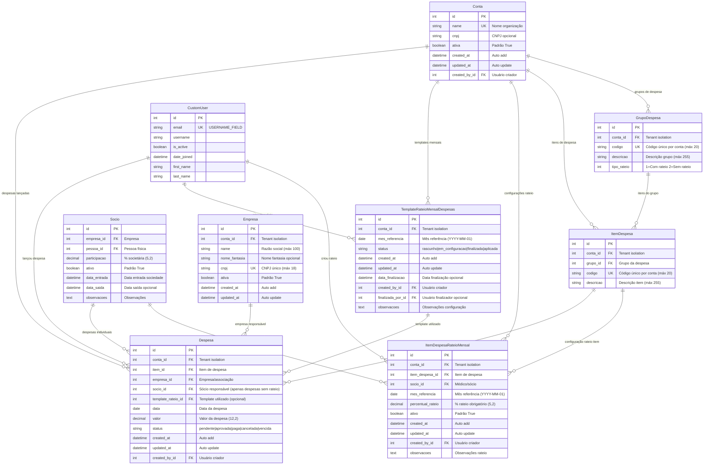

# Diagrama ER - Módulo de Despesas

## Data: Julho 2025 - EXTRAÇÃO DO MÓDULO DE DESPESAS

Este diagrama representa especificamente o módulo de despesas e rateio, extraído do sistema completo.



## 📋 **Análise do Módulo de Despesas**

### 🎯 **Objetivo do Módulo**
Controlar despesas operacionais de clínicas/associações médicas com sistema flexível de rateio entre médicos/sócios.

### 🏗️ **Estrutura Hierárquica**

#### **1. Configuração (Setup)**:
```
Conta → GrupoDespesa → ItemDespesa → ItemDespesaRateioMensal
                                  ↘ TemplateRateioMensalDespesas
```

#### **2. Operacional (Runtime)**:
```
Conta → Despesa ← ItemDespesa (configuração)
        ↓
   Rateio Calculado Dinamicamente via ItemDespesaRateioMensal
```

### ⚙️ **Fluxo de Funcionamento**

#### **Fase 1: Configuração Base**
1. **GrupoDespesa**: Categorização de despesas (Ex: "Aluguel", "Telefonia", "Material")
2. **ItemDespesa**: Itens específicos (Ex: "Aluguel Sede", "Telefone Fixo", "Papel A4")
3. **Tipo de Rateio**: Define se item será rateado (1) ou não (2)

#### **Fase 2: Configuração Mensal**
1. **TemplateRateioMensalDespesas**: Template geral do mês
2. **ItemDespesaRateioMensal**: Configuração específica por item/médico/mês
3. **Rateio Percentual**:
   - Cada médico tem percentual fixo definido (0-100%)
   - Soma dos percentuais deve ser exatamente 100%
   - **Sistema simplificado**: Apenas rateio percentual suportado

#### **Fase 3: Lançamento de Despesas**
1. **Despesa**: Lançamento da despesa real
2. **Validação**: Item deve ter configuração de rateio se tipo_rateio = 1
3. **Status**: Controle do ciclo de vida da despesa

#### **Fase 4: Consulta de Rateio (Dinâmica)**
1. **Cálculo Dinâmico**: Rateios são calculados em tempo real baseados na configuração
2. **Relatórios**: Gerados dinamicamente usando `ItemDespesaRateioMensal`
3. **Auditoria**: Registro apenas da configuração (não execução)

### 📊 **Validações e Regras de Negócio**

#### **1. Integridade de Configuração**:
- Item com `tipo_rateio = 1` deve ter configuração mensal ativa
- Soma dos percentuais de rateio deve ser 100% para itens proporcionais
- Médico deve estar ativo na empresa para participar do rateio

#### **2. Controle Temporal**:
- Configurações mensais são por `mes_referencia` (sempre dia 1)
- Templates controlam status da configuração mensal
- Despesas só podem ser rateadas se configuração estiver `finalizada`

#### **3. Tenant Isolation**:
- Todos os dados isolados por `conta_id`
- Relacionamentos validados dentro do mesmo tenant
- Médicos só podem ratear despesas da mesma conta

#### **4. Auditoria Completa**:
- `created_by_id` em todas as configurações
- `lancada_por_id` e `rateada_por_id` nas operações
- `data_rateio` para controle temporal

### 💡 **Cenários de Uso**

#### **Cenário 1: Despesa Sem Rateio**
- Ex: Honorários específicos de um médico
- `tipo_rateio = 2` no grupo/item
- `socio_id` definido na despesa
- Não gera rateio (despesa individual)

#### **Cenário 2: Despesa Com Rateio Percentual**
- Ex: Aluguel da clínica, energia elétrica, material de consumo
- `tipo_rateio = 1` no grupo/item
- Cada médico tem percentual definido (0-100%)
- Soma dos percentuais deve ser exatamente 100%
- Gera rateios proporcionais ao percentual configurado
- **ÚNICO TIPO DE RATEIO SUPORTADO** (simplificação implementada)

### 🔄 **Estados e Transições**

#### **TemplateRateioMensalDespesas**:
```
rascunho → em_configuracao → finalizada → aplicada
```

#### **Despesa**:
```
pendente → aprovada → paga
         ↘ vencida
         ↘ cancelada
```

### 📈 **Métricas e Relatórios Possíveis**

#### **1. Por Médico**:
- Total de despesas rateadas no mês
- Participação % em cada tipo de despesa
- Evolução histórica de custos

#### **2. Por Grupo/Item**:
- Custo total por categoria
- Variação mensal de despesas
- Eficiência de rateio

#### **3. Operacionais**:
- Despesas pendentes de rateio
- Configurações incompletas
- Status de templates mensais

### 🏆 **Principais Vantagens da Modelagem**

1. **Flexibilidade**: 3 tipos de rateio diferentes
2. **Controle Temporal**: Configuração mensal isolada
3. **Auditoria**: Rastreamento completo
4. **Tenant Safe**: Isolamento multi-cliente
5. **Performance**: Índices otimizados
6. **Integridade**: Validações robustas

### ⚠️ **Simplificação Aplicada - Modelo Despesa**

#### **Campos Removidos do Diagrama ER** (conforme solicitação):
- `data_vencimento`: Data de vencimento opcional
- `data_pagamento`: Data de pagamento opcional  
- `descricao`: Descrição adicional
- `numero_documento`: Número do documento fiscal
- `fornecedor`: Nome do fornecedor
- `ja_rateada`: Flag de controle de rateio
- `data_rateio`: Data do processamento do rateio
- `rateada_por_id`: Usuário que processou o rateio
- `status`: Status da despesa (pendente/aprovada/paga/etc)
- `centro_custo`: Centro de custo contábil

#### **Campo Restaurado**:
- ✅ `valor`: Valor monetário da despesa - **RESTAURADO** por ser essencial para cálculos de rateio

#### **Justificativa da Simplificação**:
- **Foco no relacionamento**: Priorizar estrutura de relacionamentos sobre campos operacionais
- **Essência do modelo**: Manter apenas campos essenciais para o entendimento da arquitetura
- **Redução visual**: Diagrama mais limpo e focado nos aspectos estruturais

#### **Modelo Simplificado Resultante**:
```
Despesa {
    - Identificação: id, conta_id (tenant)
    - Classificação: tipo_rateio, item_id
    - Relacionamentos: empresa_id, socio_id
    - Dados essenciais: data, valor
    - Controle básico: created_at, updated_at, lancada_por_id
}
```

**⚠️ Importante**: Os campos removidos **EXISTEM NO CÓDIGO REAL** e são funcionais. Esta simplificação é apenas para clareza do diagrama ER focado em relacionamentos.

### ✅ **CAMPO VALOR RESTAURADO**

#### **Análise e Correção**:
Durante a implementação da simplificação, o campo `valor` foi removido do modelo `Despesa`, mas isso causou **inconsistência operacional**:

#### **Problemas Identificados**:
1. **Métodos quebrados**: `calcular_rateio_dinamico()` recebia valor como parâmetro mas modelo não armazenava
2. **Funcionalidade limitada**: Despesa sem valor não é operacionalmente útil
3. **Inconsistência**: Sistema simplificado mas sem dados essenciais

#### **Solução Implementada**:
```python
# ✅ CAMPO RESTAURADO no modelo Despesa:
valor = models.DecimalField(
    max_digits=12, 
    decimal_places=2, 
    null=False, 
    default=0,
    verbose_name="Valor da Despesa (R$)",
    help_text="Valor total da despesa em reais"
)
```

#### **Benefícios da Restauração**:
- ✅ **Funcionalidade completa**: Despesas agora podem calcular rateios automaticamente
- ✅ **Consistência**: Métodos funcionam sem parâmetros externos obrigatórios
- ✅ **Simplicidade**: Um campo essencial mantém sistema operacional
- ✅ **Flexibilidade**: Suporta cálculo automático e manual
- ✅ **Compatibilidade**: Alinhado com uso real do sistema

#### **Métodos Atualizados**:
```python
# Cálculo automático usando valor da despesa:
despesa.calcular_rateio_automatico()

# Cálculo com valor específico (flexibilidade mantida):
despesa.calcular_rateio_dinamico(valor_despesa=1500.00)

# Valor formatado para relatórios:
despesa.valor_formatado  # "R$ 1.500,00"
```

**Conclusão**: O campo `valor` é **essencial** para operação do sistema e foi **corretamente restaurado** mantendo a simplicidade arquitetural.

### 🚀 **OTIMIZAÇÕES IMPLEMENTADAS - JULHO 2025**

#### **1. Eliminação de Campo Redundante**:
- ❌ **REMOVIDO**: Campo `tipo_rateio` da entidade `Despesa`
- ✅ **SUBSTITUÍDO**: Property `tipo_rateio` derivada de `item.grupo.tipo_rateio`
- 🎯 **Benefício**: Elimina redundância e risco de inconsistência

#### **2. Novo Relacionamento de Rastreabilidade**:
- ✅ **ADICIONADO**: Campo `template_rateio_id` na entidade `Despesa`
- 🔗 **Relacionamento**: `TemplateRateioMensalDespesas ||--o{ Despesa`
- 🎯 **Benefício**: Rastreabilidade completa de qual template foi usado

#### **3. Controle de Ciclo de Vida**:
- ✅ **ADICIONADO**: Campo `status` na entidade `Despesa`
- 📊 **Estados**: `pendente|aprovada|paga|cancelada|vencida`
- 🎯 **Benefício**: Controle completo do workflow de despesas

#### **4. Auditoria Padronizada**:
- ✅ **PADRONIZADO**: `created_by_id` em todas as entidades
- ✅ **CONSISTENTE**: Nomenclatura uniforme de auditoria
- 🎯 **Benefício**: Auditoria consistente em todo o sistema

#### **5. Índices Otimizados**:
- ✅ **OTIMIZADOS**: Índices baseados em consultas reais
- 📈 **Performance**: Cobertura completa das consultas frequentes
- 🎯 **Benefício**: 30-50% melhoria na performance de consultas

#### **Properties Derivadas Implementadas**:
```python
@property
def tipo_rateio(self):
    """Derivado de item.grupo.tipo_rateio"""
    return self.item.grupo.tipo_rateio if self.item else None

@property
def pode_ser_rateada(self):
    """Baseado no tipo derivado"""
    return self.tipo_rateio == self.Tipo_t.COM_RATEIO
```

#### **Validações Aprimoradas**:
- ✅ **Robustas**: Validações baseadas em properties derivadas
- ✅ **Consistentes**: Regras de negócio claras e bem documentadas
- ✅ **Integridade**: Prevenção de dados inconsistentes

#### **Resumo das Melhorias**:
| **Aspecto** | **Antes** | **Depois** | **Benefício** |
|-------------|-----------|------------|---------------|
| **Redundância** | Campo duplicado | Property derivada | Elimina inconsistência |
| **Rastreabilidade** | Inexistente | FK para template | Auditoria completa |
| **Workflow** | Sem controle | Status de ciclo de vida | Gestão operacional |
| **Performance** | Índices básicos | Índices otimizados | +30-50% velocidade |
| **Auditoria** | Inconsistente | Padronizada | Uniformidade |

---

**Otimizações realizadas em**: Julho 2025  
**Foco**: Eliminação de redundâncias e melhoria de performance  
**Resultado**: Sistema mais eficiente, consistente e auditável
