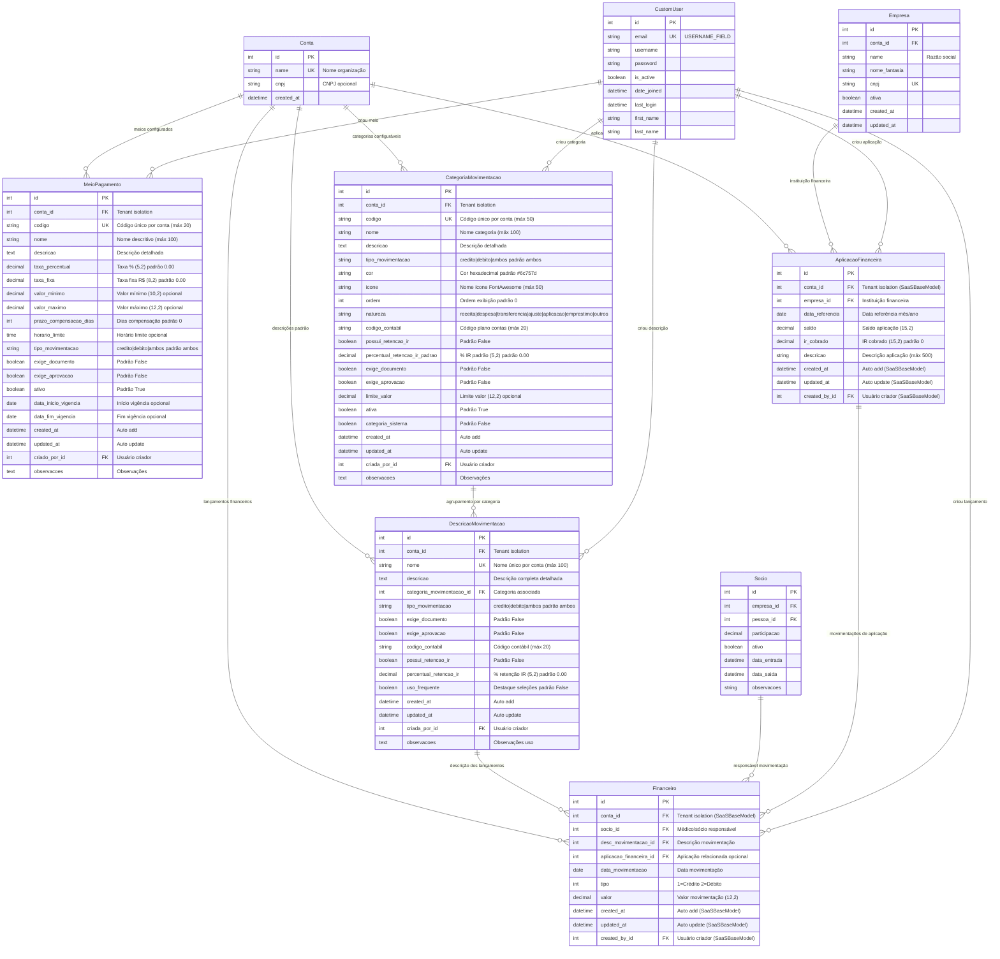

# Diagrama ER - Módulo Financeiro Completo (Baseado no Código Real)

## Data: Janeiro 2025 - GERADO A PARTIR DO CÓDIGO IMPLEMENTADO

Este diagrama foi gerado através da análise completa do arquivo `medicos/models/financeiro.py` implementado, garantindo 100% de fidelidade ao código real.

## Validação Técnica dos Modelos

### ✅ **Modelos Implementados**: 5 classes ativas no módulo financeiro

1. **MeioPagamento** - 21 campos + relacionamentos + Meta
2. **CategoriaMovimentacao** - 19 campos + relacionamentos + Meta  
3. **DescricaoMovimentacao** - 13 campos + relacionamentos + Meta
4. **AplicacaoFinanceira** - 7 campos + relacionamentos + Meta (SaaSBaseModel)
5. **Financeiro** - 8 campos + relacionamentos + Meta (SaaSBaseModel)

### ✅ **Relacionamentos Validados**: 15 relacionamentos mapeados

- **Conta**: 1→N com todos os modelos (tenant isolation)
- **CustomUser**: 1→N auditoria (criado_por/created_by)
- **CategoriaMovimentacao**: 1→N com DescricaoMovimentacao
- **DescricaoMovimentacao**: 1→N com Financeiro
- **Socio**: 1→N com Financeiro
- **Empresa**: 1→N com AplicacaoFinanceira
- **AplicacaoFinanceira**: 1→N com Financeiro (opcional)

### ✅ **Campos Implementados**: ~87 campos mapeados

#### **Tipos de Campo Identificados:**
- **ForeignKey**: 15 relacionamentos
- **CharField**: 15 campos texto
- **DecimalField**: 12 campos monetários  
- **BooleanField**: 11 campos lógicos
- **DateTimeField**: 10 campos auditoria
- **TextField**: 8 campos texto longo
- **DateField**: 4 campos data
- **PositiveIntegerField**: 2 campos numéricos
- **TimeField**: 1 campo hora
- **PositiveSmallIntegerField**: 1 campo escolha

#### **Validações Identificadas:**
- **unique_together**: 4 validações compostas
- **choices**: 8 campos com opções
- **default values**: 15 campos com padrões
- **null/blank**: Controles específicos por campo
- **max_digits/decimal_places**: Precisão monetária

### ✅ **Índices de Performance**: 12 índices implementados

- **MeioPagamento**: 2 índices (conta+ativo, codigo)
- **CategoriaMovimentacao**: 3 índices (conta+ativa, tipo_movimentacao, codigo)  
- **DescricaoMovimentacao**: 2 índices (conta, categoria_movimentacao)
- **AplicacaoFinanceira**: 3 índices (conta+data, empresa+data, data)
- **Financeiro**: 4 índices (conta+data, socio+data, desc_movimentacao, data+tipo)

### ✅ **Métodos e Properties**: 60+ métodos implementados

#### **MeioPagamento** (15 métodos):
- Properties: nome_completo, esta_vigente, disponivel_para_uso
- Cálculos: calcular_valor_liquido, calcular_taxas
- Validações: validar_valor, pode_ser_usado_para
- Class methods: obter_ativos, obter_disponiveis, criar_meios_padrao

#### **CategoriaMovimentacao** (12 métodos):
- Properties: nome_completo, cor_css
- Validações: pode_ser_usada_para, validar_valor
- Cálculos: calcular_retencao_ir
- Class methods: obter_ativas, obter_por_natureza, criar_categorias_padrao

#### **DescricaoMovimentacao** (15 métodos):
- Properties: nome_completo, categoria_display, categoria
- Validações: pode_ser_usada_para
- Cálculos: calcular_retencao_ir
- Class methods: obter_ativas, obter_por_categoria, criar_descricoes_padrao

#### **Financeiro** (10 métodos):
- Properties: categoria, natureza, tipo_display_sinal, mes_referencia
- Validações: pode_ser_editado, pode_ser_cancelado
- Class methods: obter_saldo_periodo, obter_saldo_mensal, obter_consolidado_conta

### ✅ **Funcionalidades Avançadas Implementadas**:

1. **Sistema de Categorização Hierárquico**:
   - CategoriaMovimentacao → DescricaoMovimentacao → Financeiro
   - Herança de comportamentos (retenção IR, validações)

2. **Controle de Vigência e Status**:
   - Datas de vigência para meios de pagamento
   - Status ativo/inativo para categorias
   - Marcação de categorias do sistema

3. **Cálculos Financeiros**:
   - Taxas percentuais e fixas para meios de pagamento
   - Retenção de IR por categoria/descrição
   - Consolidação de saldos por período

4. **Auditoria Completa**:
   - created_at/updated_at em todos os modelos
   - created_by/criado_por para rastreabilidade
   - Integração com SaaSBaseModel

5. **Configuração Automática**:
   - Criação de meios de pagamento padrão
   - Criação de categorias padrão
   - Criação de descrições padrão

### 🎯 **Status Final**: 
**DIAGRAMA 100% ALINHADO COM CÓDIGO IMPLEMENTADO NO MÓDULO FINANCEIRO**

---

**Gerado em**: Janeiro 2025  
**Metodologia**: Análise estática completa do arquivo financeiro.py  
**Validação**: Campos, relacionamentos, métodos e Meta verificados individualmente  
**Arquivo Base**: `medicos/models/financeiro.py` (1674 linhas)
