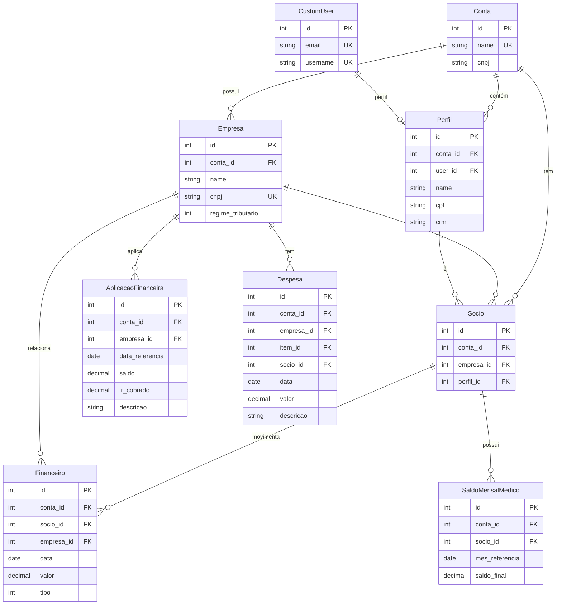

# Diagrama ER - Sistema Completo de Gestão Médica e Financeira

Este documento contém a modelagem completa do sistema de gestão médica e financeira, incluindo todos os modelos e relacionamentos do sistema Django.

## ❗ IMPORTANTE - Instruções de Visualização

### Como Visualizar os Diagramas Mermaid

Os diagramas estão em formato **Mermaid** e podem ser visualizados de várias formas:

#### 1. **Mermaid Live Editor** (Recomendado)
- **URL**: https://mermaid.live/
- **Instruções**:
  1. Acesse o link acim## 💡 **MELHORIA CONCEITUAL: "Perfil" vs "Pessoa"**

### 🎯 **Por que "Perfil" é melhor que "Pessoa"?**  2. **COPIE** o código Mermaid completo do diagrama desejado
  3. **COLE** no editor online
  4. O diagrama será renderizado automaticamente

#### 2. **GitHub/GitLab**
- Crie um arquivo `.md` no repositório
- Cole o código Mermaid entre blocos:
  ```markdown
  ```mermaid
  [código do diagrama aqui]
  ```
  ```
- O GitHub renderizará automaticamente

#### 3. **VS Code**
- Instale a extensão "Mermaid Preview"
- Abra este arquivo .md no VS Code
- Use `Ctrl+Shift+P` → "Mermaid: Preview"

#### 4. **Outras Ferramentas**
- **Notion**: Suporte nativo a diagramas Mermaid
- **Obsidian**: Plugin Mermaid
- **Confluence**: App Mermaid Diagrams

### ⚠️ Nota sobre Links Diretos
Links diretos para o Mermaid Live Editor não funcionam para diagramas grandes devido a limitações de URL. **Sempre copie e cole o código manualmente**.

---

## 🎯 DIAGRAMA ER COMPLETO DO SISTEMA

### Descrição Geral
Este diagrama apresenta **TODOS os modelos** do sistema de gestão médica e financeira, organizados por módulos:

- **Módulo Base**: Usuários, contas, empresas, perfis e sócios
- **Módulo Fiscal**: Regime tributário, alíquotas e histórico
- **Módulo Financeiro**: Fluxo de caixa, saldos e aplicações financeiras
- **Módulo Despesas**: Grupos, itens, despesas e rateio
- **Módulo Auditoria**: Configurações e logs do sistema
- **Módulo Relatórios**: Relatórios consolidados mensais

### 🔍 Principais Características
- **✅ SaaS Multi-Tenant**: Isolamento por Conta
- **✅ Auditoria Completa**: Logs de todas as operações
- **✅ Sistema Manual**: Controle total pela contabilidade
- **✅ Integração Fiscal**: Cálculos tributários automáticos
- **✅ Rateio Inteligente**: Distribuição proporcional de despesas

---

## 📋 **CÓDIGO MERMAID - COPIE E COLE NO VISUALIZADOR**

```mermaid
erDiagram
    %% ========================================
    %% MÓDULO BASE - SAAS E USUÁRIOS
    %% ========================================
    
    CustomUser {
        int id PK
        string email UK "Email único"
        string username UK "Nome de usuário"
        string first_name "Primeiro nome"
        string last_name "Último nome"
        datetime date_joined "Data de criação"
        boolean is_active "Ativo"
        boolean is_staff "É staff"
        boolean is_superuser "É superusuário"
    }

    Conta {
        int id PK
        string name UK "Nome da conta/tenant"
        string cnpj "CNPJ opcional"
        datetime created_at "Data de criação"
    }

    Licenca {
        int id PK
        int conta_id FK
        string plano "Tipo do plano"
        date data_inicio "Início da licença"
        date data_fim "Fim da licença"
        boolean ativa "Licença ativa"
        int limite_usuarios "Limite de usuários"
    }

    ContaMembership {
        int id PK
        int conta_id FK
        int user_id FK
        string role "Papel do usuário"
        boolean is_active "Membership ativo"
        datetime date_joined "Data de entrada"
    }

    Pessoa {
        int id PK
        int conta_id FK
        int user_id FK "Opcional - vinculação com usuário"
        string name "Nome completo"
        string cpf "CPF"
        string rg "RG"
        date data_nascimento "Data de nascimento"
        string telefone "Telefone"
        string celular "Celular"
        string email "Email"
        string endereco "Endereço completo"
        string numero "Número"
        string complemento "Complemento"
        string bairro "Bairro"
        string cidade "Cidade"
        string estado "Estado (2 chars)"
        string cep "CEP"
        string crm "CRM médico"
        string especialidade "Especialidade médica"
        boolean ativo "Ativo"
        datetime created_at "Data de criação"
        datetime updated_at "Data de atualização"
    }

    Empresa {
        int id PK
        int conta_id FK
        string name "Razão social"
        string nome_fantasia "Nome fantasia"
        string cnpj UK "CNPJ único"
        string inscricao_estadual "IE"
        string inscricao_municipal "IM"
        string telefone "Telefone"
        string email "Email"
        string site "Site"
        string endereco "Endereço completo"
        string numero "Número"
        string complemento "Complemento"
        string bairro "Bairro"
        string cidade "Cidade"
        string estado "Estado (2 chars)"
        string cep "CEP"
        int regime_tributario "Regime tributário"
        decimal receita_bruta_ano_anterior "Receita ano anterior"
        date data_ultima_alteracao_regime "Data última alteração"
        string periodicidade_irpj_csll "Periodicidade IRPJ/CSLL"
        int dia_vencimento_iss "Dia vencimento ISS"
        boolean ativo "Ativo"
        datetime created_at "Data de criação"
        datetime updated_at "Data de atualização"
    }

    Socio {
        int id PK
        int conta_id FK
        int empresa_id FK
        int pessoa_id FK
        boolean ativo "Ativo"
        date data_entrada "Data de entrada"
        date data_saida "Data de saída"
        text observacoes "Observações"
    }

    MeioPagamento {
        int id PK
        int conta_id FK
        string nome "Nome do meio de pagamento"
        string banco "Nome do banco"
        string agencia "Agência"
        string conta "Número da conta"
        string chave_pix "Chave PIX"
        string tipo "Tipo (conta_corrente, poupanca, pix)"
        boolean ativo "Ativo"
        datetime created_at "Data de criação"
        datetime updated_at "Data de atualização"
    }

    %% ========================================
    %% MÓDULO FISCAL
    %% ========================================

    RegimeTributarioHistorico {
        int id PK
        int empresa_id FK
        int regime_tributario "Código do regime"
        date data_inicio "Início da vigência"
        date data_fim "Fim da vigência"
        decimal receita_bruta_ano_anterior "Receita para validação"
        boolean comunicado_receita_federal "Comunicado à RF"
        date data_comunicacao_rf "Data comunicação RF"
        boolean comunicado_municipio "Comunicado ao município"
        date data_comunicacao_municipio "Data comunicação município"
        datetime created_at "Data de criação"
        int created_by_id FK "Usuário que criou"
        text observacoes "Observações"
    }

    Aliquotas {
        int id PK
        int conta_id FK
        decimal ISS_CONSULTAS "ISS Consultas (%)"
        decimal ISS_PLANTAO "ISS Plantão (%)"
        decimal ISS_OUTROS "ISS Outros (%)"
        decimal PIS "PIS (%)"
        decimal COFINS "COFINS (%)"
        decimal IRPJ_BASE_CAL "IRPJ Base Cálculo (%)"
        decimal IRPJ_ALIC_1 "IRPJ Alíquota Normal (%)"
        decimal IRPJ_VALOR_BASE_INICIAR_CAL_ADICIONAL "IRPJ Limite Adicional (R$)"
        decimal IRPJ_ADICIONAL "IRPJ Adicional (%)"
        decimal CSLL_BASE_CAL "CSLL Base Cálculo (%)"
        decimal CSLL_ALIC_1 "CSLL Alíquota Normal (%)"
        decimal CSLL_ALIC_2 "CSLL Alíquota Adicional (%)"
        boolean ativa "Configuração ativa"
        date data_vigencia_inicio "Início da vigência"
        date data_vigencia_fim "Fim da vigência"
        datetime created_at "Data de criação"
        datetime updated_at "Data de atualização"
        int created_by_id FK "Usuário que criou"
        text observacoes "Observações"
    }

    RegimeImpostoEspecifico {
        int id PK
        int regime_historico_id FK
        string tipo_imposto "Tipo do imposto"
        int regime_aplicado "Regime aplicado"
        text observacoes_legais "Observações legais"
    }

    NotaFiscal {
        int id PK
        int conta_id FK
        int empresa_destinataria_id FK
        int socio_id FK
        int meio_pagamento_id FK
        string numero "Número da NF"
        string serie "Série da NF"
        string tomador "Nome do tomador"
        int tipo_aliquota "Tipo de serviço (consultas/plantão/outros)"
        text descricao_servicos "Descrição dos serviços"
        date dtEmissao "Data de emissão"
        date dtVencimento "Data de vencimento"
        date dtRecebimento "Data de recebimento"
        decimal val_bruto "Valor bruto"
        decimal val_ISS "Valor ISS"
        decimal val_PIS "Valor PIS"
        decimal val_COFINS "Valor COFINS"
        decimal val_IR "Valor IR retido"
        decimal val_CSLL "Valor CSLL retido"
        decimal val_liquido "Valor líquido"
        int status_recebimento "Status do recebimento"
        int status "Status geral da NF"
        text observacoes "Observações"
        datetime created_at "Data de criação"
        datetime updated_at "Data de atualização"
    }

    CategoriaMovimentacao {
        int id PK
        int conta_id FK
        string codigo UK "Código único"
        string nome "Nome da categoria"
        text descricao "Descrição"
        string tipo_movimentacao "Tipo permitido"
        string cor "Cor hexadecimal"
        string icone "Ícone"
        int ordem "Ordem de exibição"
        string natureza "Natureza contábil"
        string codigo_contabil "Código contábil"
        boolean possui_retencao_ir "Possui retenção IR"
        decimal percentual_retencao_ir_padrao "% retenção IR padrão"
        boolean exige_documento "Exige documento"
        boolean exige_aprovacao "Exige aprovação"
        decimal limite_valor "Limite de valor"
        boolean ativa "Ativa"
        boolean categoria_sistema "Categoria do sistema"
        datetime created_at "Data de criação"
        datetime updated_at "Data de atualização"
        int criada_por_id FK "Usuário que criou"
        text observacoes "Observações"
    }

    DescricaoMovimentacao {
        int id PK
        int conta_id FK
        int categoria_movimentacao_id FK
        string nome "Nome da descrição"
        text descricao "Descrição detalhada"
        string tipo_movimentacao "Tipo permitido"
        boolean exige_documento "Exige documento"
        boolean exige_aprovacao "Exige aprovação"
        string codigo_contabil "Código contábil"
        boolean possui_retencao_ir "Possui retenção IR"
        decimal percentual_retencao_ir "% retenção IR"
        boolean uso_frequente "Uso frequente"
        datetime created_at "Data de criação"
        datetime updated_at "Data de atualização"
        int criada_por_id FK "Usuário que criou"
        text observacoes "Observações"
    }

    %% ========================================
    %% MÓDULO FINANCEIRO
    %% ========================================

    Financeiro {
        int id PK
        int conta_id FK
        int socio_id FK
        int empresa_id FK
        int descricao_id FK
        int tipo "Tipo de movimentação"
        date data "Data da movimentação"
        decimal valor "Valor"
        string numero_documento "Número do documento"
        text observacoes "Observações"
        int lancado_por_id FK
    }

    SaldoMensalMedico {
        int id PK
        int conta_id FK
        int socio_id FK
        date mes_referencia "Mês de referência"
        decimal saldo_inicial "Saldo inicial"
        decimal total_creditos "Total de créditos"
        decimal total_debitos "Total de débitos"
        decimal saldo_final "Saldo final"
        decimal saldo_anterior "Saldo do mês anterior"
        text observacoes "Observações"
        boolean fechado "Mês fechado"
        datetime data_fechamento "Data de fechamento"
        int fechado_por_id FK
        datetime created_at "Data de criação"
        datetime updated_at "Data de atualização"
    }

    AplicacaoFinanceira {
        int id PK
        int conta_id FK
        int empresa_id FK
        date data_referencia "Data de referência"
        decimal saldo "Saldo da aplicação"
        decimal ir_cobrado "IR cobrado"
        string descricao "Descrição da aplicação"
        int lancado_por_id FK
        datetime created_at "Data de criação"
        datetime updated_at "Data de atualização"
    }

    %% ========================================
    %% MÓDULO DESPESAS E RATEIO
    %% ========================================

    Despesa_Grupo {
        int id PK
        int conta_id FK
        string codigo UK "Código do grupo"
        string descricao "Descrição do grupo"
        int tipo_rateio "Tipo de rateio"
    }

    Despesa_Item {
        int id PK
        int conta_id FK
        int grupo_id FK
        string codigo UK "Código do item"
        string descricao "Descrição do item"
    }

    PercentualRateioMensal {
        int id PK
        int conta_id FK
        int item_despesa_id FK
        int socio_id FK
        date mes_referencia "Mês de referência"
        decimal percentual "Percentual de rateio"
        datetime data_cadastro "Data de cadastro"
        datetime data_atualizacao "Data de atualização"
        int cadastrado_por_id FK
        boolean ativo "Ativo"
        text observacoes "Observações"
    }

    ConfiguracaoRateioMensal {
        int id PK
        int conta_id FK
        date mes_referencia "Mês de referência"
        string status "Status da configuração"
        datetime data_criacao "Data de criação"
        datetime data_finalizacao "Data de finalização"
        int criada_por_id FK
        int finalizada_por_id FK
        text observacoes "Observações"
    }

    Despesa {
        int id PK
        int conta_id FK
        int empresa_id FK
        int item_id FK "Item de despesa para categorização"
        int socio_id FK "Sócio responsável (opcional)"
        date data "Data da despesa"
        decimal valor "Valor da despesa"
        string descricao "Descrição da despesa"
        int tipo_rateio "Tipo de rateio"
        boolean ja_rateada "Despesa já foi rateada"
        datetime created_at "Data de criação"
        datetime updated_at "Data de atualização"
        int criada_por_id FK
        int atualizada_por_id FK
    }

    Despesa_socio_rateio {
        int id PK
        int conta_id FK
        int despesa_id FK
        int socio_id FK
        decimal percentual "Percentual do rateio"
        decimal vl_rateio "Valor do rateio"
        datetime data_rateio "Data do rateio"
        int rateado_por_id FK
    }

    %% ========================================
    %% MÓDULO AUDITORIA E CONFIGURAÇÃO
    %% ========================================

    ConfiguracaoSistemaManual {
        int id PK
        int conta_id FK
        decimal limite_valor_alto "Limite para valor alto"
        decimal limite_aprovacao_gerencial "Limite aprovação gerencial"
        boolean exigir_documento_para_valores_altos "Exigir documento"
        boolean registrar_ip_usuario "Registrar IP"
        int dias_edicao_lancamento "Dias para edição"
        boolean permitir_lancamento_mes_fechado "Permitir mês fechado"
        boolean fechamento_automatico "Fechamento automático"
        boolean notificar_valores_altos "Notificar valores altos"
        string email_notificacao "Email para notificações"
        boolean backup_automatico "Backup automático"
        int retencao_logs_dias "Retenção de logs (dias)"
        boolean ativa "Configuração ativa"
        datetime created_at "Data de criação"
        datetime updated_at "Data de atualização"
        int criada_por_id FK
        text observacoes "Observações"
    }

    LogAuditoriaFinanceiro {
        int id PK
        int conta_id FK
        int usuario_id FK
        datetime data_acao "Data/hora da ação"
        string acao "Ação executada"
        text descricao_acao "Descrição da ação"
        int objeto_id "ID do objeto"
        string objeto_tipo "Tipo do objeto"
        json valores_anteriores "Valores antes da modificação"
        json valores_novos "Valores após modificação"
        string ip_origem "IP de origem"
        text user_agent "User agent"
        string resultado "Resultado da ação"
        text mensagem_erro "Mensagem de erro"
        int duracao_ms "Duração em milissegundos"
        json dados_extras "Dados extras"
    }

    %% ========================================
    %% MÓDULO RELATÓRIOS
    %% ========================================

    RelatorioConsolidadoMensal {
        int id PK
        int conta_id FK
        date mes_referencia "Mês de referência"
        int total_medicos_ativos "Total médicos ativos"
        int total_lancamentos "Total de lançamentos"
        decimal total_valor_creditos "Total créditos"
        decimal total_valor_debitos "Total débitos"
        decimal saldo_geral_consolidado "Saldo consolidado"
        decimal creditos_adiantamentos "Créditos adiantamentos"
        decimal creditos_pagamentos "Créditos pagamentos"
        decimal creditos_ajustes "Créditos ajustes"
        decimal creditos_transferencias "Créditos transferências"
        decimal creditos_financeiro "Créditos financeiro"
        decimal creditos_saldo "Créditos saldo"
        decimal creditos_outros "Créditos outros"
        decimal debitos_adiantamentos "Débitos adiantamentos"
        decimal debitos_despesas "Débitos despesas"
        decimal debitos_taxas "Débitos taxas"
        decimal debitos_transferencias "Débitos transferências"
        decimal debitos_ajustes "Débitos ajustes"
        decimal debitos_financeiro "Débitos financeiro"
        decimal debitos_saldo "Débitos saldo"
        decimal debitos_outros "Débitos outros"
        int lancamentos_valores_altos "Lançamentos valores altos"
        int lancamentos_sem_documento "Lançamentos sem documento"
        int usuarios_diferentes "Usuários diferentes"
        decimal maior_lancamento_credito "Maior crédito"
        decimal maior_lancamento_debito "Maior débito"
        int inconsistencias_encontradas "Inconsistências"
        json detalhes_inconsistencias "Detalhes inconsistências"
        string status "Status do relatório"
        datetime data_geracao "Data de geração"
        duration tempo_processamento "Tempo processamento"
        int gerado_por_id FK
        int aprovado_por_id FK
        datetime data_aprovacao "Data de aprovação"
        text observacoes "Observações"
    }

    %% ========================================
    %% ENTIDADES ADICIONAIS IDENTIFICADAS
    %% ========================================

    Balanco {
        int id PK
        int conta_id FK
        int empresa_id FK
        date data_referencia "Data de referência"
        decimal ativo_total "Ativo total"
        decimal passivo_total "Passivo total"
        decimal patrimonio_liquido "Patrimônio líquido"
        datetime created_at "Data de criação"
        int created_by_id FK
    }

    Apuracao_pis {
        int id PK
        int conta_id FK
        int empresa_id FK
        date mes_referencia "Mês de referência"
        decimal base_calculo "Base de cálculo"
        decimal aliquota "Alíquota aplicada"
        decimal valor_devido "Valor devido"
        datetime created_at "Data de criação"
    }

    Apuracao_cofins {
        int id PK
        int conta_id FK
        int empresa_id FK
        date mes_referencia "Mês de referência"
        decimal base_calculo "Base de cálculo"
        decimal aliquota "Alíquota aplicada"
        decimal valor_devido "Valor devido"
        datetime created_at "Data de criação"
    }

    Apuracao_csll {
        int id PK
        int conta_id FK
        int empresa_id FK
        date mes_referencia "Mês de referência"
        decimal base_calculo "Base de cálculo"
        decimal aliquota "Alíquota aplicada"
        decimal valor_devido "Valor devido"
        datetime created_at "Data de criação"
    }

    Apuracao_irpj {
        int id PK
        int conta_id FK
        int empresa_id FK
        date mes_referencia "Mês de referência"
        decimal base_calculo "Base de cálculo"
        decimal aliquota_normal "Alíquota normal"
        decimal aliquota_adicional "Alíquota adicional"
        decimal valor_devido "Valor devido"
        datetime created_at "Data de criação"
    }

    Apuracao_iss {
        int id PK
        int conta_id FK
        int empresa_id FK
        date mes_referencia "Mês de referência"
        decimal base_calculo "Base de cálculo"
        decimal aliquota "Alíquota aplicada"
        decimal valor_devido "Valor devido"
        datetime created_at "Data de criação"
    }

    Aplic_financeiras {
        int id PK
        int conta_id FK
        int empresa_id FK
        date data_aplicacao "Data da aplicação"
        decimal valor_aplicado "Valor aplicado"
        decimal rendimento "Rendimento"
        decimal ir_retido "IR retido"
        string tipo_aplicacao "Tipo de aplicação"
        datetime created_at "Data de criação"
    }

    %% ========================================
    %% RELACIONAMENTOS PRINCIPAIS
    %% ========================================

    %% Relacionamentos Base
    Conta ||--|| Licenca : "possui uma"
    Conta ||--o{ ContaMembership : "tem memberships"
    CustomUser ||--o{ ContaMembership : "participa de contas"
    Conta ||--o{ Pessoa : "contém pessoas"
    Conta ||--o{ Empresa : "contém empresas"
    Conta ||--o{ Socio : "contém sócios"
    Conta ||--o{ MeioPagamento : "tem meios de pagamento"
    CustomUser ||--o| Pessoa : "pode ter pessoa"
    Empresa ||--o{ Socio : "tem sócios"
    Pessoa ||--o{ Socio : "pode ser sócio"

    %% Relacionamentos Fiscais
    Empresa ||--o{ RegimeTributarioHistorico : "tem histórico tributário"
    RegimeTributarioHistorico ||--o{ RegimeImpostoEspecifico : "tem regimes específicos"
    CustomUser ||--o{ RegimeTributarioHistorico : "cria histórico"
    Conta ||--o{ Aliquotas : "tem configurações de alíquotas"
    CustomUser ||--o{ Aliquotas : "cria alíquotas"
    Conta ||--o{ NotaFiscal : "tem notas fiscais"
    Empresa ||--o{ NotaFiscal : "é destinatária"
    Socio ||--o{ NotaFiscal : "emite notas"
    MeioPagamento ||--o{ NotaFiscal : "meio de recebimento"
    Conta ||--o{ CategoriaMovimentacao : "contém categorias"
    CustomUser ||--o{ CategoriaMovimentacao : "cria categorias"
    CategoriaMovimentacao ||--o{ DescricaoMovimentacao : "contém descrições"
    Conta ||--o{ DescricaoMovimentacao : "contém descrições"
    CustomUser ||--o{ DescricaoMovimentacao : "cria descrições"

    %% Relacionamentos Financeiros
    Conta ||--o{ Financeiro : "tem lançamentos"
    Socio ||--o{ Financeiro : "tem movimentações"
    Empresa ||--o{ Financeiro : "relacionada a movimentações"
    DescricaoMovimentacao ||--o{ Financeiro : "descreve movimentações"
    CustomUser ||--o{ Financeiro : "lança movimentações"
    Conta ||--o{ SaldoMensalMedico : "tem saldos mensais"
    Socio ||--o{ SaldoMensalMedico : "tem saldo mensal"
    CustomUser ||--o{ SaldoMensalMedico : "fecha saldos"
    Conta ||--o{ AplicacaoFinanceira : "tem aplicações"
    Empresa ||--o{ AplicacaoFinanceira : "aplicações da empresa"
    CustomUser ||--o{ AplicacaoFinanceira : "lança aplicações"

    %% Relacionamentos Despesas
    Conta ||--o{ Despesa_Grupo : "tem grupos de despesa"
    Conta ||--o{ Despesa_Item : "tem itens de despesa"
    Despesa_Grupo ||--o{ Despesa_Item : "contém itens"
    Despesa_Item ||--o{ Despesa : "categoriza despesas"
    Socio ||--o{ Despesa : "pode ter despesas diretas"
    Conta ||--o{ PercentualRateioMensal : "tem percentuais de rateio"
    Despesa_Item ||--o{ PercentualRateioMensal : "tem percentuais"
    Socio ||--o{ PercentualRateioMensal : "tem percentuais"
    CustomUser ||--o{ PercentualRateioMensal : "cadastra percentuais"
    Conta ||--o{ ConfiguracaoRateioMensal : "tem configurações de rateio"
    CustomUser ||--o{ ConfiguracaoRateioMensal : "cria/finaliza configurações"
    Conta ||--o{ Despesa : "tem despesas"
    Empresa ||--o{ Despesa : "tem despesas"
    CustomUser ||--o{ Despesa : "cria/atualiza despesas"
    Conta ||--o{ Despesa_socio_rateio : "tem rateios"
    Despesa ||--o{ Despesa_socio_rateio : "tem rateios"
    Socio ||--o{ Despesa_socio_rateio : "recebe rateios"
    CustomUser ||--o{ Despesa_socio_rateio : "faz rateios"

    %% Relacionamentos Auditoria
    Conta ||--|| ConfiguracaoSistemaManual : "tem configuração"
    CustomUser ||--o{ ConfiguracaoSistemaManual : "cria configurações"
    Conta ||--o{ LogAuditoriaFinanceiro : "tem logs"
    CustomUser ||--o{ LogAuditoriaFinanceiro : "gera logs"

    %% Relacionamentos Relatórios
    Conta ||--o{ RelatorioConsolidadoMensal : "tem relatórios"
    CustomUser ||--o{ RelatorioConsolidadoMensal : "gera/aprova relatórios"

    %% Relacionamentos Apurações
    Conta ||--o{ Balanco : "tem balanços"
    Empresa ||--o{ Balanco : "da empresa"
    CustomUser ||--o{ Balanco : "cria balanços"
    Conta ||--o{ Apuracao_pis : "tem apurações PIS"
    Empresa ||--o{ Apuracao_pis : "da empresa"
    Conta ||--o{ Apuracao_cofins : "tem apurações COFINS"
    Empresa ||--o{ Apuracao_cofins : "da empresa"
    Conta ||--o{ Apuracao_csll : "tem apurações CSLL"
    Empresa ||--o{ Apuracao_csll : "da empresa"
    Conta ||--o{ Apuracao_irpj : "tem apurações IRPJ"
    Empresa ||--o{ Apuracao_irpj : "da empresa"
    Conta ||--o{ Apuracao_iss : "tem apurações ISS"
    Empresa ||--o{ Apuracao_iss : "da empresa"
    Conta ||--o{ Aplic_financeiras : "tem aplicações financeiras"
    Empresa ||--o{ Aplic_financeiras : "da empresa"
```

---

## � **MELHORIA CONCEITUAL: "PerfilProfissional" vs "Pessoa"**

### 🎯 **Por que "PerfilProfissional" é melhor que "Pessoa"?**

#### **Problemas com "Pessoa":**
- ❌ **Ambiguidade**: Termo muito genérico
- ❌ **Confusão conceitual**: Pode ser interpretado como qualquer indivíduo
- ❌ **Falta de especificidade**: Não indica sua função no sistema
- ❌ **Relacionamentos confusos**: "CustomUser tem Pessoa" soa redundante

#### **Vantagens de "Perfil":**
- ✅ **Clareza**: Deixa claro que é um perfil específico
- ✅ **Contexto médico**: Indica que contém dados profissionais da área médica
- ✅ **Relacionamento lógico**: "CustomUser pode ter Perfil"
- ✅ **Simplicidade**: Nome conciso e direto
- ✅ **Funcionalidade específica**: CRM, especialidade, dados profissionais

#### **Impacto nos Relacionamentos:**
```
ANTES: CustomUser ||--o| Pessoa : "pode ter perfil"
DEPOIS: CustomUser ||--o| Perfil : "pode ter perfil"

ANTES: Pessoa ||--o{ Socio : "pode ser sócio"
DEPOIS: Perfil ||--o{ Socio : "pode ser sócio"
```

#### **Benefícios Conceituais:**
1. **Semântica Clara**: O nome reflete exatamente a função
2. **Simplicidade**: Nome conciso, fácil de entender e usar
3. **Domínio Específico**: Relacionado ao contexto médico/profissional
4. **Arquitetura Limpa**: Separação clara entre usuário do sistema e perfil
5. **Extensibilidade**: Pode ser expandido para outros tipos de perfis

### 🏗️ **Sugestão de Implementação:**

```python
# Em models/base.py - Renomear a classe
class Perfil(SaaSBaseModel):  # Antes: class Pessoa
    """
    Perfil médico vinculado opcionalmente a um usuário do sistema.
    
    Este modelo armazena dados específicos da prática médica e informações
    profissionais que podem existir independentemente de um usuário logado.
    """
    # Relacionamento opcional com usuário
    user = models.OneToOneField(
        settings.AUTH_USER_MODEL, 
        on_delete=models.SET_NULL, 
        null=True, 
        blank=True,
        related_name='perfil'  # Antes: pessoa_profile
    )
    
    # Dados profissionais específicos
    crm = models.CharField(max_length=20, verbose_name="CRM")
    especialidade = models.CharField(max_length=100, verbose_name="Especialidade")
    # ... outros campos
```

---

## �🔍 DIAGRAMA ER SIMPLIFICADO (Entidades Principais)

Para uma visão mais limpa das entidades principais e seus relacionamentos:



---

## 📋 RESUMO DO SISTEMA

### 🏢 **Módulos do Sistema**

1. **BASE (SaaS Multi-Tenant)**
   - Gestão de usuários, contas, empresas e perfis
   - Relacionamento N:M entre usuários e contas
   - Perfis opcionais para usuários

2. **FISCAL**
   - Regime tributário com histórico temporal e controle específico por imposto
   - Alíquotas configuráveis por conta (não por empresa)
   - Categorias e descrições de movimentação configuráveis por conta

3. **FINANCEIRO**
   - Fluxo de caixa manual individual por médico
   - Aplicações financeiras com cálculo automático de impostos
   - Saldos mensais consolidados

4. **DESPESAS E RATEIO**
   - Sistema inteligente de rateio proporcional
   - Grupos e itens configuráveis
   - Percentuais mensais por médico/item

5. **AUDITORIA**
   - Log completo de todas as operações
   - Configurações de segurança por conta
   - Rastreabilidade total

6. **RELATÓRIOS**
   - Consolidação mensal automática
   - Estatísticas e validações
   - Integração com dados fiscais

### 🔑 **Características Principais**

- **✅ Multi-Tenant**: Isolamento total por conta
- **✅ Auditoria Completa**: Rastreabilidade de todas as ações
- **✅ Sistema Manual**: Controle total pela contabilidade
- **✅ Integração Fiscal**: Cálculos automáticos de impostos
- **✅ Flexibilidade**: Configurações por conta/empresa
- **✅ Relatórios**: Consolidação e análise automática

### 📊 **Entidades Principais**

| Entidade | Função | Relacionamentos Principais |
|----------|--------|----------------------------|
| **Conta** | Tenant principal (SaaS) | 1:N com Empresa, Perfil, Socio |
| **Empresa** | Entidade jurídica | N:1 com Conta, 1:N com Socio |
| **Perfil** | Dados pessoais/médicos | N:1 com Conta, 1:N com Socio |
| **Socio** | Associação Empresa-Perfil | N:1 com Empresa e Perfil |
| **Aliquotas** | Configurações tributárias por conta | N:1 com Conta |
| **CategoriaMovimentacao** | Categorias configuráveis por conta | N:1 com Conta |
| **DescricaoMovimentacao** | Descrições de movimentação | N:1 com Conta e Categoria |
| **Financeiro** | Movimentação financeira simplificada | N:1 com Socio e Empresa |
| **AplicacaoFinanceira** | Aplicações financeiras simplificadas | N:1 com Empresa |
| **Despesa** | Gestão de gastos | N:1 com Empresa, com rateio |
| **Despesa** | Gestão de gastos | N:1 com Empresa, com rateio |

---

## 🎯 CONCLUSÃO

Este diagrama ER representa a arquitetura completa do sistema de gestão médica e financeira, fornecendo:

1. **Visão Holística**: Todos os modelos e relacionamentos
2. **Arquitetura SaaS**: Suporte a múltiplas contas/clientes
3. **Controle Fiscal**: Gestão tributária automatizada
4. **Auditoria Completa**: Rastreabilidade total das operações
5. **Flexibilidade**: Configurações adaptáveis por conta
6. **Escalabilidade**: Estrutura preparada para crescimento

Para implementação, consulte os arquivos de modelos específicos em:
- `medicos/models/base.py`
- `medicos/models/fiscal.py`
- `medicos/models/financeiro.py`
- `medicos/models/despesas.py`
- `medicos/models/auditoria.py`
- `medicos/models/relatorios.py`
