# Diagrama ER Completo - Sistema de Gestão Médica/Financeira

```mermaid
erDiagram
    %% ===============================
    %% MÓDULO BASE - Autenticação e Tenant
    %% ===============================
    
    CustomUser ||--o{ ContaMembership : "pode ter"
    CustomUser ||--o| Pessoa : "profile"
    
    Conta ||--o{ ContaMembership : "tem"
    Conta ||--|| Licenca : "possui"
    Conta ||--o{ Empresa : "contém"
    Conta ||--o{ Pessoa : "escopo"
    Conta ||--o{ MeioPagamento : "configurados"
    Conta ||--o{ Aliquotas : "configurações"
    Conta ||--o{ ConfiguracaoSistemaManual : "configuração"
    Conta ||--o{ RelatorioConsolidadoMensal : "relatórios"
    Conta ||--o{ Despesa_Grupo : "grupos"
    Conta ||--o{ Despesa_Item : "itens"
    Conta ||--o{ PercentualRateioMensal : "rateios"
    
    %% ===============================
    %% ENTIDADES PRINCIPAIS
    %% ===============================
    
    CustomUser {
        int id PK
        string email UK "USERNAME_FIELD"
        string username
        string password
        boolean is_active
        datetime date_joined
        datetime last_login
    }
    
    Conta {
        int id PK
        string name UK "Nome da organização"
        string cnpj "CNPJ opcional"
        datetime created_at
    }
    
    Licenca {
        int id PK
        int conta_id FK "Conta relacionada"
        string plano "Tipo de plano"
        date data_inicio
        date data_fim
        boolean ativa
        int limite_usuarios
    }
    
    ContaMembership {
        int id PK
        int conta_id FK
        int user_id FK
        string role "admin|contabilidade|medico|readonly"
        boolean is_active
        datetime date_joined
    }
    
    Pessoa {
        int id PK
        int conta_id FK "Tenant isolation"
        int user_id FK "Opcional"
        string name "Nome completo"
        string cpf
        string rg
        date data_nascimento
        string telefone
        string celular
        string email
        string endereco
        string numero
        string complemento
        string bairro
        string cidade
        string estado
        string cep
        string crm "Para médicos"
        string especialidade
        boolean ativo
        datetime created_at
        datetime updated_at
    }
    
    Empresa {
        int id PK
        int conta_id FK "Tenant isolation"
        string name "Razão social"
        string nome_fantasia
        string cnpj UK "CNPJ único"
        string inscricao_estadual
        string inscricao_municipal
        string telefone
        string email
        string site
        string endereco
        string numero
        string complemento
        string bairro
        string cidade
        string estado
        string cep
        int regime_tributario "1=Competência, 2=Caixa"
        decimal receita_bruta_ano_anterior "Para validação regime caixa"
        date data_ultima_alteracao_regime
        string periodicidade_irpj_csll "MENSAL|TRIMESTRAL"
        int dia_vencimento_iss
        string observacoes_tributarias
        boolean ativa
        datetime created_at
        datetime updated_at
    }
    
    Socio {
        int id PK
        int empresa_id FK
        int pessoa_id FK
        decimal participacao "Percentual de participação"
        boolean ativo
        datetime data_entrada
        datetime data_saida
        string observacoes
    }
    
    %% ===============================
    %% MÓDULO FISCAL - Impostos e Notas Fiscais
    %% ===============================
    
    Empresa ||--o{ RegimeTributarioHistorico : "histórico"
    Empresa ||--o{ NotaFiscal : "emite"
    
    RegimeTributarioHistorico ||--o{ RegimeImpostoEspecifico : "regimes específicos"
    
    Conta ||--o{ Aliquotas : "configurações"
    
    NotaFiscal }o--|| MeioPagamento : "recebimento via"
    
    RegimeTributarioHistorico {
        int id PK
        int empresa_id FK
        int regime_tributario "1=Competência, 2=Caixa"
        date data_inicio "Sempre 1º janeiro"
        date data_fim "Null se vigente"
        decimal receita_bruta_ano_anterior
        boolean comunicado_receita_federal
        date data_comunicacao_rf
        boolean comunicado_municipio
        date data_comunicacao_municipio
        datetime created_at
        int created_by_id FK
        text observacoes
    }
    
    Aliquotas {
        int id PK
        int conta_id FK
        decimal ISS_CONSULTAS "Alíquota ISS consultas"
        decimal ISS_PLANTAO "Alíquota ISS plantão"
        decimal ISS_OUTROS "Alíquota ISS outros"
        decimal PIS "Alíquota PIS"
        decimal COFINS "Alíquota COFINS"
        decimal IRPJ_BASE_CAL "Base cálculo IRPJ %"
        decimal IRPJ_ALIC_1 "Alíquota normal IRPJ"
        decimal IRPJ_VALOR_BASE_INICIAR_CAL_ADICIONAL "Limite adicional"
        decimal IRPJ_ADICIONAL "Alíquota adicional IRPJ"
        decimal CSLL_BASE_CAL "Base cálculo CSLL %"
        decimal CSLL_ALIC_1 "Alíquota normal CSLL"
        decimal CSLL_ALIC_2 "Alíquota adicional CSLL"
        boolean ativa
        date data_vigencia_inicio
        date data_vigencia_fim
        datetime created_at
        datetime updated_at
        int created_by_id FK
        text observacoes
    }
    
    RegimeImpostoEspecifico {
        int id PK
        int regime_historico_id FK
        string tipo_imposto "ISS|PIS|COFINS|IRPJ|CSLL"
        int regime_aplicado "1=Competência, 2=Caixa"
        text observacoes_legais
    }
    
    NotaFiscal {
        int id PK
        string numero "Número da NF"
        string serie "Série (padrão 1)"
        int empresa_destinataria_id FK "Empresa emitente"
        string tomador "Nome do tomador"
        int tipo_aliquota "1=Consultas, 2=Plantão, 3=Outros"
        text descricao_servicos
        date dtEmissao "Data emissão"
        date dtVencimento "Data vencimento"
        date dtRecebimento "Data recebimento"
        decimal val_bruto "Valor bruto"
        decimal val_ISS "Valor ISS"
        decimal val_PIS "Valor PIS"
        decimal val_COFINS "Valor COFINS"
        decimal val_IR "Valor IRPJ"
        decimal val_CSLL "Valor CSLL"
        decimal val_liquido "Valor líquido"
        string status_recebimento "pendente|parcial|completo|cancelado"
        int meio_pagamento_id FK "Meio pagamento"
        decimal valor_recebido "Valor recebido"
        string numero_documento_recebimento
        text detalhes_recebimento
        string status "ativa|cancelada|substituida"
        text observacoes
        datetime created_at
        datetime updated_at
        int created_by_id FK
    }
    
    %% ===============================
    %% MÓDULO DESPESAS - Gestão de Despesas e Rateio
    %% ===============================
    
    Conta ||--o{ Despesa_Grupo : "grupos"
    Despesa_Grupo ||--o{ Despesa_Item : "itens"
    Despesa_Item ||--o{ PercentualRateioMensal : "rateios"
    Despesa_Item ||--o{ ConfiguracaoRateioMensal : "configurações"
    Despesa_Item ||--o{ Despesa : "despesas"
    Socio ||--o{ PercentualRateioMensal : "percentuais"
    Socio ||--o{ Despesa_socio_rateio : "rateios"
    Despesa ||--o{ Despesa_socio_rateio : "distribuição"
    
    Despesa_Grupo {
        int id PK
        int conta_id FK
        string codigo "GERAL|FOLHA|SOCIO"
        string descricao
        int tipo_rateio "1=Com rateio, 2=Sem rateio"
    }
    
    Despesa_Item {
        int id PK
        int conta_id FK
        int grupo_id FK
        string codigo "Código do item"
        string descricao "Descrição do item"
    }
    
    PercentualRateioMensal {
        int id PK
        int conta_id FK
        int item_despesa_id FK
        int socio_id FK
        date mes_referencia "YYYY-MM-01"
        decimal percentual "% rateio (0-100)"
        boolean ativo
        datetime created_at
        datetime updated_at
        int created_by_id FK
        text observacoes
    }
    
    ConfiguracaoRateioMensal {
        int id PK
        int conta_id FK
        int item_despesa_id FK
        date mes_referencia "YYYY-MM-01"
        string tipo_configuracao "percentual_fixo|valor_fixo|proporcional"
        json parametros_configuracao "Parâmetros específicos"
        boolean ativa
        datetime created_at
        datetime updated_at
        int created_by_id FK
        text observacoes
    }
    
    Despesa {
        int id PK
        int conta_id FK
        int grupo_id FK
        int item_id FK
        string numero_documento
        string descricao
        decimal valor
        date data_vencimento
        date data_pagamento
        int tipo_despesa "1=Com rateio, 2=Sem rateio"
        string status "pendente|pago|cancelado"
        string observacoes
        datetime created_at
        datetime updated_at
        int created_by_id FK
    }
    
    Despesa_socio_rateio {
        int id PK
        int despesa_id FK
        int socio_id FK
        decimal valor_rateado "Valor para este sócio"
        decimal percentual_aplicado "% aplicado"
        string status "pendente|pago|cancelado"
        text observacoes
        datetime created_at
        datetime updated_at
    }
    
    %% ===============================
    %% MÓDULO FINANCEIRO - Fluxo de Caixa Manual
    %% ===============================
    
    Conta ||--o{ MeioPagamento : "meios"
    Conta ||--o{ DescricaoMovimentacao : "descrições"
    Conta ||--o{ CategoriaMovimentacao : "categorias"
    Conta ||--o{ AplicacaoFinanceira : "aplicações"
    
    MeioPagamento ||--o{ NotaFiscal : "usado em"
    DescricaoMovimentacao ||--o{ Financeiro : "usada em"
    CategoriaMovimentacao ||--o{ DescricaoMovimentacao : "agrupamento"
    Socio ||--o{ SaldoMensalMedico : "saldos"
    AplicacaoFinanceira ||--o{ Financeiro : "movimentações"
    
    MeioPagamento {
        int id PK
        int conta_id FK
        string codigo UK "Código único"
        string nome "Nome descritivo"
        text descricao
        decimal taxa_percentual "Taxa %"
        decimal taxa_fixa "Taxa fixa R$"
        decimal valor_minimo "Valor mínimo"
        decimal valor_maximo "Valor máximo"
        int prazo_compensacao_dias "Dias para compensar"
        string tipo_movimentacao "credito|debito|ambos"
        boolean ativo
        string observacoes
        datetime created_at
        datetime updated_at
        int created_by_id FK
    }
    
    CategoriaMovimentacao {
        int id PK
        int conta_id FK
        string codigo UK "Código único"
        string nome "Nome da categoria"
        text descricao
        string tipo_movimentacao "credito|debito|ambos"
        string cor_hexadecimal "Para UI"
        boolean ativa
        int ordem_exibicao
        datetime created_at
        datetime updated_at
    }
    
    DescricaoMovimentacao {
        int id PK
        int conta_id FK
        int categoria_id FK
        string codigo UK "Código único"
        string descricao "Descrição da movimentação"
        int tipo_movimentacao "1=Crédito, 2=Débito"
        decimal valor_sugerido "Valor padrão"
        boolean ativa
        boolean padrao_sistema "Se é descrição do sistema"
        int ordem_exibicao
        datetime created_at
        datetime updated_at
    }
    
    Financeiro {
        int id PK
        int conta_id FK
        int socio_id FK "Médico/sócio"
        int desc_movimentacao_id FK
        int aplicacao_financeira_id FK "Opcional"
        date data_movimentacao
        decimal valor
        string numero_documento
        text observacoes
        datetime created_at
        datetime updated_at
        int created_by_id FK
    }
    
    SaldoMensalMedico {
        int id PK
        int conta_id FK
        int socio_id FK
        date mes_referencia "YYYY-MM-01"
        decimal saldo_inicial
        decimal total_creditos
        decimal total_debitos
        decimal saldo_final
        boolean fechado "Se o mês foi fechado"
        datetime data_fechamento
        int fechado_por_id FK
        datetime created_at
        datetime updated_at
    }
    
    AplicacaoFinanceira {
        int id PK
        int conta_id FK
        string nome "Nome da aplicação"
        string tipo "CDB|LCI|LCA|TESOURO|OUTROS"
        string instituicao "Banco/corretora"
        decimal taxa_rendimento "Taxa % a.a."
        string tipo_rendimento "prefixado|pos_fixado|ipca"
        date data_aplicacao
        date data_vencimento
        decimal valor_aplicado
        decimal valor_atual
        date data_ultima_atualizacao
        boolean ativa
        text observacoes
        datetime created_at
        datetime updated_at
        int created_by_id FK
    }
    
    %% ===============================
    %% MÓDULO AUDITORIA - Logs e Configurações
    %% ===============================
    
    Conta ||--|| ConfiguracaoSistemaManual : "configuração"
    Conta ||--o{ LogAuditoriaFinanceiro : "logs"
    
    ConfiguracaoSistemaManual {
        int id PK
        int conta_id FK
        decimal limite_valor_alto "Limite para documentação"
        decimal limite_aprovacao_gerencial
        boolean exigir_documento_para_valores_altos
        boolean registrar_ip_usuario
        int dias_edicao_lancamento
        boolean permitir_lancamento_mes_fechado
        boolean fechamento_automatico
        boolean notificar_valores_altos
        string email_notificacao
        boolean backup_automatico
        int dias_retencao_backup
        string observacoes
        datetime created_at
        datetime updated_at
    }
    
    LogAuditoriaFinanceiro {
        int id PK
        int conta_id FK
        int usuario_id FK
        string acao "CREATE|UPDATE|DELETE|VIEW"
        string modelo "Nome do modelo alterado"
        int objeto_id "ID do objeto"
        json dados_anteriores "Estado anterior"
        json dados_posteriores "Estado posterior"
        string ip_usuario "IP de origem"
        string user_agent "Navegador/app"
        datetime timestamp
        text observacoes
    }
    
    %% ===============================
    %% MÓDULO RELATÓRIOS - Consolidação
    %% ===============================
    
    Conta ||--o{ RelatorioConsolidadoMensal : "relatórios"
    
    RelatorioConsolidadoMensal {
        int id PK
        int conta_id FK
        date mes_referencia "YYYY-MM-01"
        int total_medicos_ativos
        int total_lancamentos
        decimal total_valor_creditos
        decimal total_valor_debitos
        decimal saldo_geral_consolidado
        decimal creditos_adiantamentos
        decimal creditos_pagamentos
        decimal creditos_ajustes
        decimal creditos_transferencias
        decimal creditos_financeiro
        decimal creditos_saldo
        decimal creditos_outros
        decimal debitos_adiantamentos
        decimal debitos_despesas
        decimal debitos_taxas
        decimal debitos_transferencias
        decimal debitos_ajustes
        decimal debitos_financeiro
        decimal debitos_saldo
        decimal debitos_outros
        int lancamentos_valores_altos
        int lancamentos_sem_documento
        int total_inconsistencias
        text observacoes_auditoria
        json metadados_geracao
        datetime data_geracao
        int gerado_por_id FK
        boolean finalizado
    }
    
    %% ===============================
    %% RELACIONAMENTOS ESPECÍFICOS
    %% ===============================
    
    Empresa ||--o{ Socio : "possui"
    Pessoa ||--o{ Socio : "é sócio em"
    
    CustomUser ||--o{ RegimeTributarioHistorico : "criou"
    CustomUser ||--o{ Aliquotas : "criou"
    CustomUser ||--o{ NotaFiscal : "criou"
    CustomUser ||--o{ PercentualRateioMensal : "criou"
    CustomUser ||--o{ ConfiguracaoRateioMensal : "criou"
    CustomUser ||--o{ Despesa : "criou"
    CustomUser ||--o{ MeioPagamento : "criou"
    CustomUser ||--o{ Financeiro : "criou"
    CustomUser ||--o{ AplicacaoFinanceira : "criou"
    CustomUser ||--o{ SaldoMensalMedico : "fechou"
    CustomUser ||--o{ RelatorioConsolidadoMensal : "gerou"
    CustomUser ||--o{ LogAuditoriaFinanceiro : "ação de"
```

## Resumo da Modelagem

### Características Principais:

1. **Arquitetura SaaS Multi-Tenant**
   - `Conta` como entidade principal de isolamento
   - Todos os modelos principais vinculados à `Conta`
   - Sistema de memberships com roles diferenciados

2. **Módulos Bem Definidos**
   - **Base**: Autenticação, usuários, empresas, pessoas
   - **Fiscal**: Impostos, regimes tributários, notas fiscais
   - **Despesas**: Gestão de despesas com sistema de rateio
   - **Financeiro**: Fluxo de caixa manual e aplicações
   - **Auditoria**: Logs e configurações do sistema
   - **Relatórios**: Consolidação e análises

3. **Principais Funcionalidades**
   - Gestão completa de notas fiscais com cálculo automático de impostos
   - Sistema de rateio flexível para despesas
   - Controle de regimes tributários com histórico
   - Fluxo de caixa manual com categorização
   - Auditoria completa de todas as operações
   - Relatórios consolidados mensais

4. **Conformidade Legal**
   - Regimes tributários conforme legislação brasileira
   - Controle de periodicidade de impostos
   - Validações específicas por tipo de imposto
   - Histórico de alterações de regime

### Total de Entidades: 22 modelos principais
