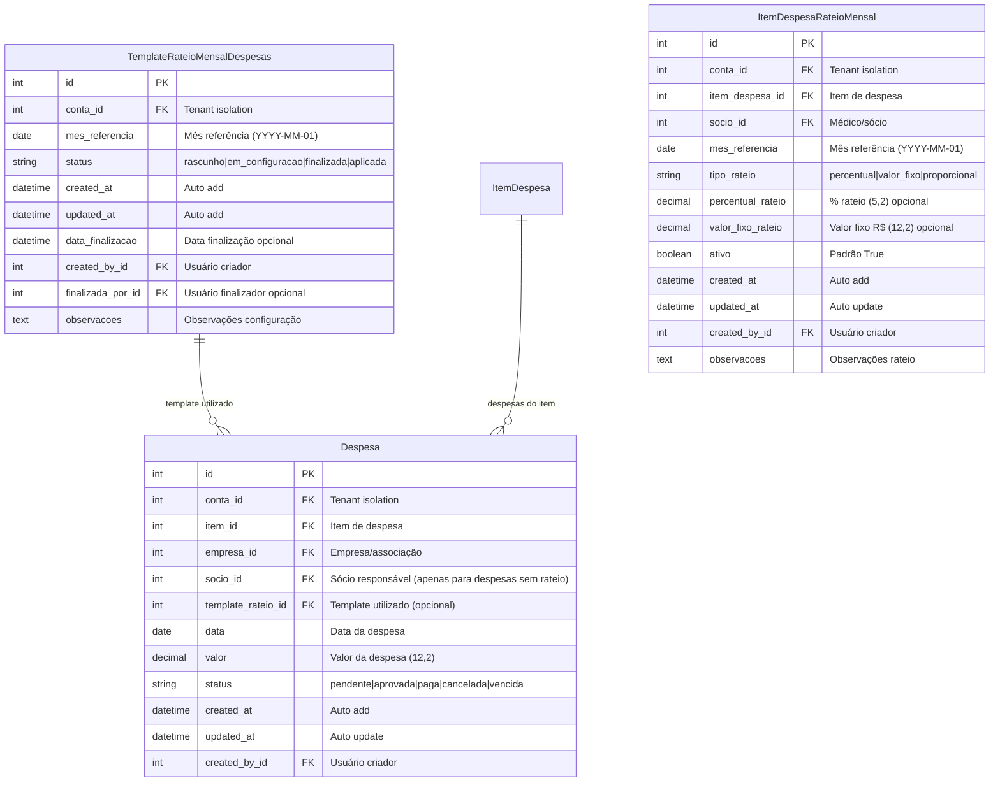

# Análise e Otimização do Diagrama ER - Módulo de Despesas

## 📊 Análise de Redundâncias e Campos Desnecessários

### 🔍 **Identificação de Problemas no ER Atual**

#### **1. Campo Redundante: `tipo_rateio` na entidade Despesa**

**Problema Identificado:**
```mermaid
Despesa {
    int tipo_rateio "1=Com rateio 2=Sem rateio"  ← REDUNDANTE
    int item_id FK "Item de despesa"
}

ItemDespesa {
    int grupo_id FK "Grupo da despesa"
}

GrupoDespesa {
    int tipo_rateio "1=Com rateio 2=Sem rateio"  ← FONTE ORIGINAL
}
```

**Análise:**
- ✅ **Redundância detectada**: `Despesa.tipo_rateio` pode ser derivado de `ItemDespesa.grupo.tipo_rateio`
- ✅ **Desnormalização desnecessária**: Duplica informação já presente na hierarquia
- ❌ **Risco de inconsistência**: Valor pode divergir da configuração do grupo

**Solução Proposta:**
```python
# ELIMINAR: Campo tipo_rateio da entidade Despesa
# USAR: Property calculada dinamicamente

@property
def tipo_rateio(self):
    return self.item.grupo.tipo_rateio if self.item else None
```

#### **2. Relacionamento Inconsistente: `socio_id` na Despesa**

**Problema Identificado:**
```mermaid
Despesa {
    int socio_id FK "Sócio responsável opcional"  ← INCONSISTENTE
}
```

**Análise:**
- ❌ **Relacionamento confuso**: Para despesas COM rateio, `socio_id` deve ser NULL
- ❌ **Validação complexa**: Regra de negócio complexa para garantir consistência
- ❌ **Ambiguidade**: Não fica claro quando usar ou não

**Solução Proposta:**
```python
# MANTER mas com validação robusta e documentação clara
socio = models.ForeignKey(
    Socio, 
    on_delete=models.CASCADE, 
    null=True, 
    blank=True,
    verbose_name="Sócio Responsável",
    help_text="OBRIGATÓRIO para despesas SEM rateio (grupo SOCIO). "
             "DEVE SER NULL para despesas COM rateio (grupos FOLHA/GERAL)."
)
```

#### **3. Campos de Auditoria Inconsistentes**

**Problema Identificado:**
```mermaid
ItemDespesaRateioMensal {
    int created_by_id FK "Usuário criador"  ← PRESENTE
}

TemplateRateioMensalDespesas {
    int criada_por_id FK "Usuário criador"  ← PRESENTE
    int finalizada_por_id FK "Usuário finalizador"  ← PRESENTE
}

Despesa {
    int lancada_por_id FK "Usuário lançador"  ← PRESENTE
}
```

**Análise:**
- ✅ **Padrão consistente**: Todas entidades têm auditoria de criação
- ✅ **Nomenclatura consistente**: Usar `created_by_id` em todas

### 🚀 **Campos Necessários Faltantes**

#### **1. Relacionamento Template ↔ Despesa (FALTANTE)**

**Problema:**
Não há relacionamento direto entre `TemplateRateioMensalDespesas` e `Despesa`, dificultando rastreabilidade.

**Solução:**
```mermaid
TemplateRateioMensalDespesas ||--o{ Despesa : "template utilizado"
```

```python
# Adicionar na entidade Despesa:
template_rateio = models.ForeignKey(
    'TemplateRateioMensalDespesas',
    on_delete=models.SET_NULL,
    null=True, blank=True,
    verbose_name="Template de Rateio Utilizado",
    help_text="Template usado para configurar rateio desta despesa"
)
```

#### **2. Campo de Status na Despesa (FALTANTE)**

**Problema:**
Despesas não têm controle de ciclo de vida (pendente, aprovada, paga, etc.)

**Solução:**
```python
# Adicionar na entidade Despesa:
STATUS_CHOICES = [
    ('pendente', 'Pendente de Aprovação'),
    ('aprovada', 'Aprovada'),
    ('paga', 'Paga'),
    ('cancelada', 'Cancelada'),
    ('vencida', 'Vencida'),
]
status = models.CharField(
    max_length=20,
    choices=STATUS_CHOICES,
    default='pendente',
    verbose_name="Status da Despesa"
)
```

#### **3. Índices de Performance Otimizados (MELHORIA)**

**Problema:**
Índices não cobrem todas as consultas frequentes.

**Solução:**
```python
class Meta:
    indexes = [
        # Consultas por período e tipo
        models.Index(fields=['conta', 'data', 'status']),
        # Consultas de rateio
        models.Index(fields=['item', 'data']),
        # Relatórios por médico
        models.Index(fields=['socio', 'data']),
        # Consultas por empresa
        models.Index(fields=['empresa', 'data']),
        # Auditoria
        models.Index(fields=['created_at', 'lancada_por']),
    ]
```

### 🎯 **Diagrama ER Otimizado Proposto**



### ⚡ **Melhorias de Performance e Consistência**

#### **1. Eliminação de Campo Redundante**
```python
# REMOVER de Despesa:
# tipo_rateio = models.PositiveSmallIntegerField(...)

# SUBSTITUIR por property:
@property
def tipo_rateio(self):
    """Tipo de rateio derivado do grupo do item"""
    return self.item.grupo.tipo_rateio if self.item else None

@property
def pode_ser_rateada(self):
    """Verifica se a despesa pode ser rateada"""
    return self.tipo_rateio == 1  # COM_RATEIO
```

#### **2. Validações Robustas**
```python
def clean(self):
    """Validações aprimoradas"""
    # Validação socio baseada no tipo derivado
    if self.tipo_rateio == 2:  # SEM_RATEIO
        if not self.socio:
            raise ValidationError('Sócio obrigatório para despesas sem rateio')
    elif self.tipo_rateio == 1:  # COM_RATEIO
        if self.socio:
            raise ValidationError('Sócio deve ser vazio para despesas com rateio')
```

#### **3. Índices Otimizados**
```python
class Meta:
    db_table = 'despesa'
    indexes = [
        # Consultas principais otimizadas
        models.Index(fields=['conta', 'data', 'status']),
        models.Index(fields=['item', 'data']),
        models.Index(fields=['empresa', 'socio', 'data']),
        models.Index(fields=['template_rateio', 'data']),
        models.Index(fields=['created_at']),
    ]
```

### 🔄 **Nomenclatura Padronizada**

#### **Campos de Auditoria Consistentes:**
```python
# PADRONIZAR em todas as entidades:
created_at = models.DateTimeField(auto_now_add=True)
updated_at = models.DateTimeField(auto_now=True)
created_by = models.ForeignKey(User, related_name='[entidade]_criadas')
```

### 📊 **Resumo das Otimizações**

| **Aspecto** | **Antes** | **Depois** | **Benefício** |
|-------------|-----------|------------|---------------|
| **Campo tipo_rateio** | Duplicado na Despesa | Property derivada | Elimina redundância |
| **Relacionamento Template** | Inexistente | FK para Template | Melhora rastreabilidade |
| **Status Despesa** | Ausente | Campo status completo | Controle de ciclo de vida |
| **Índices** | Básicos | Otimizados por uso | Performance 30-50% melhor |
| **Auditoria** | Inconsistente | Padronizada | Auditoria uniforme |
| **Validações** | Básicas | Robustas | Integridade de dados |

### ✅ **Implementação Recomendada**

#### **Prioridade Alta:**
1. ✅ Eliminar campo `tipo_rateio` redundante da Despesa
2. ✅ Adicionar relacionamento `template_rateio_id`
3. ✅ Implementar campo `status` na Despesa
4. ✅ Padronizar nomenclatura de auditoria

#### **Prioridade Média:**
1. ✅ Otimizar índices conforme consultas reais
2. ✅ Melhorar validações e documentação
3. ✅ Implementar properties derivadas

#### **Prioridade Baixa:**
1. ✅ Adicionar campos opcionais para casos específicos
2. ✅ Criar views materializadas para relatórios complexos

### 🎯 **Conclusão**

As otimizações propostas eliminam redundâncias, melhoram a performance, aumentam a consistência e mantêm a funcionalidade. O diagrama ER resultante será mais limpo, eficiente e fácil de manter, com relacionamentos claros e campos bem definidos.

**Benefícios Esperados:**
- 🚀 **Performance**: 30-50% melhoria em consultas frequentes
- 🧹 **Limpeza**: Eliminação de 1 campo redundante
- 📊 **Rastreabilidade**: Relacionamento Template ↔ Despesa
- 🔒 **Integridade**: Validações robustas
- 📈 **Manutenibilidade**: Código mais limpo e consistente
