# Diagrama de Relacionamentos - Sistema Médicos SaaS

## Estrutura do Banco de Dados

```mermaid
erDiagram
    %% Modelos Core SaaS
    CustomUser {
        int id PK
        string email UK
        string username
        string first_name
        string last_name
        boolean is_active
        datetime date_joined
    }

    Conta {
        int id PK
        string name UK
        string cnpj
        datetime created_at
    }

    Licenca {
        int id PK
        int conta_id FK
        string plano
        date data_inicio
        date data_fim
        boolean ativa
        int limite_usuarios
    }

    ContaMembership {
        int id PK
        int user_id FK
        int conta_id FK
        string role
        datetime date_joined
        int invited_by_id FK
    }

    %% Modelos de Negócio
    Pessoa {
        int id PK
        int conta_id FK
        string CPF
        int type_of_person
        string name
        string profissao
        date dnascimento
        string address1
        string zipcode
        string city
        string phone1
        string email
        int status
        datetime created_at
        datetime updated_at
    }

    Empresa {
        int id PK
        int conta_id FK
        string CNPJ
        string name
        int status
        int tipo_regime
    }

    Socio {
        int id PK
        int conta_id FK
        int empresa_id FK
        int pessoa_id FK
    }

    Alicotas {
        int id PK
        int conta_id FK
        decimal ISS
        decimal PIS
        decimal COFINS
        decimal IRPJ_BASE_CAL
        decimal IRPJ_ALIC_1
        decimal IRPJ_ALIC_2
        decimal IRPJ_VALOR_BASE_INICIAR_CAL_ADICIONAL
        decimal IRPJ_ADICIONAL
        decimal CSLL_BASE_CAL
        decimal CSLL_ALIC_1
        decimal CSLL_ALIC_2
    }

    %% Modelos de Despesas
    Despesa_Grupo {
        int id PK
        int conta_id FK
        string codigo
        string descricao
        int tipo_rateio
    }

    Despesa_Item {
        int id PK
        int conta_id FK
        int grupo_id FK
        string codigo
        string descricao
    }

    Despesa {
        int id PK
        int conta_id FK
        int tipo_rateio
        int item_id FK
        int empresa_id FK
        int socio_id FK
        date data
        decimal valor
        string descricao
    }

    Despesa_socio_rateio {
        int id PK
        int conta_id FK
        int fornecedor_id FK
        int socio_id FK
        int despesa_id FK
        decimal percentual
        decimal vl_rateio
    }

    %% Modelos Fiscais
    NotaFiscal {
        int id PK
        int conta_id FK
        string numero
        string tomador
        int fornecedor_id FK
        int socio_id FK
        date dtEmissao
        date dtRecebimento
        decimal val_bruto
        decimal val_liquido
        decimal val_ISS
        decimal val_PIS
        decimal val_COFINS
        decimal val_IR
        decimal val_CSLL
        int tipo_aliquota
    }

    Balanco {
        int id PK
        int conta_id FK
        date data
        int empresa_id FK
        int socio_id FK
        decimal receita_bruta_notas_emitidas
        decimal recebido_consultas
        decimal recebido_plantao
        decimal recebido_outros
        decimal recebido_total
        decimal receita_bruta_trimestre
        decimal faturamento_servicos_consultas
        decimal faturamento_servicos_plantao
        decimal faturamento_servicos_outros
        decimal receita_bruta_total
        decimal receita_liquida_total
        decimal imposto_csll_base_calculo
        decimal imposto_csll_imposto_devido
        decimal imposto_csll_imposto_retido
        decimal imposto_csll_imposto_pagar
        decimal imposto_irpj_base_calculo
        decimal imposto_irpj_imposto_devido
        decimal imposto_irpj_imposto_adicional
        decimal imposto_irpj_imposto_retido
        decimal imposto_irpj_imposto_pagar
        decimal imposto_iss_base_calculo
        decimal imposto_iss_imposto_devido
        decimal imposto_iss_imposto_retido
        decimal imposto_imposto_iss_imposto_pagar
        decimal imposto_PIS_devido
        decimal imposto_COFINS_devido
        decimal imposto_total
        decimal despesa_com_rateio
        decimal despesa_sem_rateio
        decimal despesa_total
        decimal despesa_socio_total
        decimal despesa_folha_rateio
        decimal despesa_geral_rateio
        decimal saldo_movimentacao_financeira
        decimal saldo_apurado
        decimal saldo_a_transferir
    }

    %% Modelos de Apuração
    Apuracao_pis {
        int id PK
        int conta_id FK
        date data
        int fornecedor_id FK
        decimal base_calculo
        decimal imposto_devido
        decimal imposto_retido
        decimal imposto_pagar
        decimal saldo_mes_anterior
        decimal saldo_mes_seguinte
    }

    Apuracao_cofins {
        int id PK
        int conta_id FK
        date data
        int fornecedor_id FK
        decimal base_calculo
        decimal imposto_devido
        decimal imposto_retido
        decimal imposto_pagar
        decimal saldo_mes_anterior
        decimal saldo_mes_seguinte
    }

    Apuracao_csll {
        int id PK
        int conta_id FK
        date data
        int trimestre
        int fornecedor_id FK
        decimal receita_consultas
        decimal receita_plantao
        decimal receita_outros
        decimal receita_bruta
        decimal base_calculo
        decimal rend_aplicacao
        decimal irrf_aplicacao
        decimal base_calculo_total
        decimal imposto_devido
        decimal imposto_retido
        decimal imposto_pagar
        decimal imposto_adicional
    }

    Apuracao_irpj {
        int id PK
        int conta_id FK
        date data
        int trimestre
        int fornecedor_id FK
        decimal receita_consultas
        decimal receita_plantao
        decimal receita_outros
        decimal receita_bruta
        decimal base_calculo
        decimal rend_aplicacao
        decimal irrf_aplicacao
        decimal base_calculo_total
        decimal imposto_devido
        decimal imposto_retido
        decimal imposto_pagar
        decimal imposto_adicional
    }

    Apuracao_iss {
        int id PK
        int conta_id FK
        date data
        int fornecedor_id FK
        decimal base_calculo
        decimal imposto_devido
        decimal imposto_retido
        decimal imposto_pagar
        decimal saldo_mes_anterior
    }

    Aplic_financeiras {
        int id PK
        int conta_id FK
        date data
        int fornecedor_id FK
        decimal rendimentos
        decimal irrf
        string descricao
    }

    %% Modelos Financeiros
    Desc_movimentacao_financeiro {
        int id PK
        int conta_id FK
        string descricao
    }

    Financeiro {
        int id PK
        int conta_id FK
        date data
        int fornecedor_id FK
        int socio_id FK
        int notafiscal_id FK
        int tipo
        int descricao_id FK
        string nota
        decimal valor
        boolean operacao_auto
    }

    %% Relacionamentos SaaS Core
    Conta ||--|| Licenca : "possui"
    CustomUser ||--o{ ContaMembership : "membro de"
    Conta ||--o{ ContaMembership : "tem membros"
    CustomUser ||--o{ ContaMembership : "convidou"

    %% Relacionamentos com Conta (Multi-tenancy)
    Conta ||--o{ Pessoa : "possui"
    Conta ||--o{ Empresa : "possui"
    Conta ||--o{ Socio : "possui"
    Conta ||--o{ Alicotas : "possui"
    Conta ||--o{ Despesa_Grupo : "possui"
    Conta ||--o{ Despesa_Item : "possui"
    Conta ||--o{ Despesa : "possui"
    Conta ||--o{ Despesa_socio_rateio : "possui"
    Conta ||--o{ NotaFiscal : "possui"
    Conta ||--o{ Balanco : "possui"
    Conta ||--o{ Apuracao_pis : "possui"
    Conta ||--o{ Apuracao_cofins : "possui"
    Conta ||--o{ Apuracao_csll : "possui"
    Conta ||--o{ Apuracao_irpj : "possui"
    Conta ||--o{ Apuracao_iss : "possui"
    Conta ||--o{ Aplic_financeiras : "possui"
    Conta ||--o{ Desc_movimentacao_financeiro : "possui"
    Conta ||--o{ Financeiro : "possui"

    %% Relacionamentos de Negócio
    Empresa ||--o{ Socio : "tem sócios"
    Pessoa ||--o{ Socio : "é sócio de"
    
    Despesa_Grupo ||--o{ Despesa_Item : "contém itens"
    Despesa_Item ||--o{ Despesa : "gera despesas"
    Empresa ||--o{ Despesa : "fornecedor"
    Socio ||--o{ Despesa : "relacionado"
    
    Empresa ||--o{ Despesa_socio_rateio : "fornecedor"
    Socio ||--o{ Despesa_socio_rateio : "recebe rateio"
    Despesa ||--o{ Despesa_socio_rateio : "rateada"
    
    Empresa ||--o{ NotaFiscal : "fornecedor"
    Socio ||--o{ NotaFiscal : "emitida por"
    
    Empresa ||--o{ Balanco : "empresa"
    Socio ||--o{ Balanco : "sócio"
    
    %% Relacionamentos de Apuração
    Empresa ||--o{ Apuracao_pis : "fornecedor"
    Empresa ||--o{ Apuracao_cofins : "fornecedor"
    Empresa ||--o{ Apuracao_csll : "fornecedor"
    Empresa ||--o{ Apuracao_irpj : "fornecedor"
    Empresa ||--o{ Apuracao_iss : "fornecedor"
    Empresa ||--o{ Aplic_financeiras : "fornecedor"
    
    %% Relacionamentos Financeiros
    Empresa ||--o{ Financeiro : "fornecedor"
    Socio ||--o{ Financeiro : "sócio"
    NotaFiscal ||--o{ Financeiro : "origem"
    Desc_movimentacao_financeiro ||--o{ Financeiro : "descrição"
```

## Resumo dos Relacionamentos

### 🏢 **Arquitetura SaaS (Multi-tenant)**
- **Conta**: Entidade central (tenant) que isola dados
- **Licenca**: Define plano e limites por conta
- **ContaMembership**: Usuários associados a contas com papéis

### 👥 **Entidades de Pessoas e Empresas**
- **Pessoa**: Pessoas físicas do sistema
- **Empresa**: Pessoas jurídicas/fornecedores
- **Socio**: Relacionamento many-to-many entre Pessoa e Empresa

### 💰 **Gestão de Despesas**
- **Despesa_Grupo**: Categorias de despesas (GERAL, FOLHA, SOCIO)
- **Despesa_Item**: Itens específicos dentro de cada grupo
- **Despesa**: Registros de despesas com valores
- **Despesa_socio_rateio**: Distribuição de despesas entre sócios

### 📋 **Documentos Fiscais**
- **NotaFiscal**: Notas fiscais emitidas
- **Alicotas**: Alíquotas de impostos configuráveis
- **Balanco**: Demonstrativo consolidado por sócio/empresa

### 🏛️ **Apurações Fiscais**
- **Apuracao_pis**: Apuração mensal de PIS
- **Apuracao_cofins**: Apuração mensal de COFINS
- **Apuracao_csll**: Apuração trimestral de CSLL
- **Apuracao_irpj**: Apuração trimestral de IRPJ
- **Apuracao_iss**: Apuração mensal de ISS

### 💳 **Movimentação Financeira**
- **Financeiro**: Movimentações de crédito/débito
- **Desc_movimentacao_financeiro**: Descrições padronizadas
- **Aplic_financeiras**: Aplicações e rendimentos financeiros

### 🔒 **Segurança e Isolamento**
- Todos os modelos de negócio possuem FK para `Conta`
- Constraints `unique_together` garantem unicidade por tenant
- Validações automáticas de licença ativa
- Manager customizado para filtros automáticos por conta

## Características do Design

✅ **Multi-tenancy**: Isolamento completo de dados por conta  
✅ **Escalabilidade**: Estrutura preparada para múltiplos clientes  
✅ **Flexibilidade**: Configurações específicas por tenant  
✅ **Auditoria**: Campos de created_at/updated_at  
✅ **Integridade**: Relacionamentos bem definidos  
✅ **Negócio**: Cobertura completa do domínio médico/contábil  
