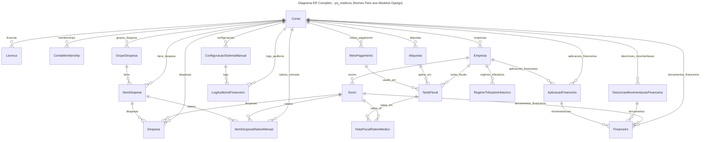

# Documentação Específica do Aplicativo prj_medicos

Este documento reúne todas as regras de negócio, fluxos funcionais, detalhes de cadastro, seleção de empresa, gestão de alíquotas, convites de usuários, rotas pendentes, modelagem de dados e exemplos específicos do sistema.

---

## 1. Regras de Negócio

### Cadastro de Usuário
- Todo usuário deve estar vinculado a pelo menos uma Conta (multi-tenant).
- Usuários sem vínculo não têm acesso ao sistema.
- O vínculo é feito via model `ContaMembership`.

### Validação de Licença
- O acesso do usuário à Conta depende da validade da licença (`Licenca.is_valida()`).
- Usuários de contas com licença expirada são redirecionados para a tela de licença expirada.

### Constraints de Modelos
- Respeitar `unique_together` e demais constraints definidas nos models.
- Validações adicionais devem ser implementadas no método `clean()` dos models.

### Abordagem SaaS Multi-Tenant
- O sistema segue arquitetura SaaS multi-tenant, onde cada usuário deve estar vinculado a uma ou mais contas (model `Conta`).
- O isolamento de dados entre tenants é garantido por constraints e validações no código.
- Toda autenticação, autorização e acesso a dados considera o contexto da conta ativa do usuário.
- Usuários sem vínculo com conta não têm acesso ao sistema.

### Registro e Criação de Conta
- O usuário poderá se registrar no sistema e criar sua própria Conta (tenant) de forma autônoma.
- O processo de registro deve criar automaticamente o vínculo entre o usuário e a nova Conta.
- Usuários registrados sem Conta não terão acesso ao sistema até concluírem o processo de criação/vinculação.

### Confirmação de Registro por E-mail
- Após o registro, o usuário recebe um e-mail com um link de ativação.
- O acesso ao sistema só é liberado após a confirmação do e-mail.
- O link de ativação expira após determinado tempo (ex: 48h).
- Caso o link expire, o usuário pode solicitar novo e-mail de ativação.
- Implementação baseada em token seguro e view dedicada para ativação.

---

## 2. Fluxos Funcionais e Detalhes de Cadastro

### Seleção de Empresa no Dashboard
- O usuário pode escolher a empresa ativa no dashboard, persistida na sessão.
- Contexto global para todas operações, garantindo isolamento multi-tenant.

### Cadastro e Gestão de Alíquotas
- Cadastro, consulta e gestão de alíquotas fiscais (INSS, IRRF, ISS, etc.)
- Histórico de vigências, rastreabilidade, interface padronizada.
- Apenas alíquotas vigentes são consideradas nos cálculos atuais, mas o histórico é mantido para auditoria.

### Cadastro de Empresas Médicas
- Cadastro realizado por administradores.
- Validação de CNPJ, vinculação como tenant, logs de auditoria.
- Templates de lista com paginação e botão "Novo".

### Convite e Cadastro de Usuários
- Convite automático por e-mail ao criar usuário.
- Link único de ativação, expiração, logs de convites.

### Rotas e Funcionalidades Pendentes
- Templates devem indicar rotas/funcionalidades pendentes com `href="#"` ou botão desabilitado.

---

## 3. Modelagem de Dados

### Diagrama ER Completo

---

Este documento deve ser revisado e atualizado sempre que novas regras de negócio ou fluxos específicos forem implementados no projeto.
