# Diagrama ER Completo - Projeto Django (hardcoded)

```mermaid
erDiagram
    Conta {
        int id PK
        string name UK
        string cnpj
        datetime created_at
    }
    Licenca {
        int id PK
        int conta_id FK
        string plano
        date data_inicio
        date data_fim
        boolean ativa
        int limite_usuarios
    }
    Empresa {
        int id PK
        int conta_id FK
        string name
        string nome_fantasia
        string cnpj UK
        boolean ativa
        datetime created_at
        datetime updated_at
    }
    Pessoa {
        int id PK
        int conta_id FK
        int user_id FK
        string nome
        string cpf
        string rg
        date data_nascimento
        string email
        string telefone
        string endereco
        datetime created_at
        datetime updated_at
    }
    Socio {
        int id PK
        int conta_id FK
        int empresa_id FK
        int pessoa_id FK
        decimal participacao
        boolean ativo
        datetime data_entrada
        datetime data_saida
        string observacoes
    }
    ContaMembership {
        int id PK
        int conta_id FK
        int user_id FK
        string role
        boolean is_active
    }
    GrupoDespesa {
        int id PK
        int conta_id FK
        string codigo
        string descricao
        int tipo_rateio
    }
    ItemDespesa {
        int id PK
        int conta_id FK
        int grupo_id FK
        string codigo
        string descricao
    }
    ItemDespesaRateioMensal {
        int id PK
        int conta_id FK
        int item_despesa_id FK
        int socio_id FK
        decimal valor
        date mes_referencia
        boolean ativo
    }
    TemplateRateioMensalDespesas {
        int id PK
        int conta_id FK
        string nome
        date data_criacao
        boolean ativo
    }
    Despesa {
        int id PK
        int conta_id FK
        int item_id FK
        int empresa_id FK
        int socio_id FK
        int template_rateio_id FK
        decimal valor
        date data
        string descricao
        boolean paga
        datetime created_at
        datetime updated_at
    }
    MeioPagamento {
        int id PK
        int conta_id FK
        string codigo
        string nome
        text descricao
        decimal taxa_percentual
        decimal taxa_fixa
        decimal valor_minimo
        decimal valor_maximo
        int prazo_compensacao_dias
        time horario_limite
        string tipo_movimentacao
        boolean exige_documento
        boolean exige_aprovacao
        boolean ativo
        date data_inicio_vigencia
        date data_fim_vigencia
        datetime created_at
        datetime updated_at
        int criado_por_id FK
        text observacoes
    }
    DescricaoMovimentacaoFinanceira {
        int id PK
        int conta_id FK
        string nome
        text descricao
        string tipo_movimentacao
        boolean exige_documento
        boolean exige_aprovacao
        string codigo_contabil
        boolean possui_retencao_ir
        decimal percentual_retencao_ir
        boolean uso_frequente
        datetime created_at
        datetime updated_at
        int criada_por_id FK
        text observacoes
    }
    AplicacaoFinanceira {
        int id PK
        int conta_id FK
        int empresa_id FK
        date data_referencia
        decimal saldo
        decimal ir_cobrado
        string descricao
        datetime created_at
        datetime updated_at
        int created_by_id FK
    }
    Financeiro {
        int id PK
        int conta_id FK
        int socio_id FK
        int desc_movimentacao_id FK
        date data_movimentacao
        int tipo
        decimal valor
        datetime created_at
        datetime updated_at
        int created_by_id FK
    }
    ConfiguracaoSistemaManual {
        int id PK
        int conta_id FK
        decimal limite_valor_alto
        decimal limite_aprovacao_gerencial
        boolean exigir_documento_para_valores_altos
        boolean registrar_ip_usuario
        int dias_edicao_lancamento
        boolean permitir_lancamento_mes_fechado
        boolean fechamento_automatico
        boolean notificar_valores_altos
        string email_notificacao
        boolean backup_automatico
        int retencao_logs_dias
        boolean ativa
        datetime created_at
        datetime updated_at
        int criada_por_id FK
        text observacoes
    }
    LogAuditoriaFinanceiro {
        int id PK
        int conta_id FK
        int usuario_id FK
        string acao
        string tabela
        int registro_id
        datetime data
        text detalhes
    }
    Aliquotas {
        int id PK
        int conta_id FK
        decimal ISS_CONSULTAS
        decimal ISS_PLANTAO
        decimal ISS_OUTROS
        decimal PIS
        decimal COFINS
        decimal IRPJ_BASE_CAL
        decimal IRPJ_ALIC_1
        decimal IRPJ_VALOR_BASE_INICIAR_CAL_ADICIONAL
        decimal IRPJ_ADICIONAL
        decimal CSLL_BASE_CAL
        decimal CSLL_ALIC_1
        decimal CSLL_ALIC_2
        boolean ativa
        date data_vigencia_inicio
        date data_vigencia_fim
        datetime created_at
        datetime updated_at
        int created_by_id FK
        text observacoes
    }
    RegimeTributarioHistorico {
        int id PK
        int empresa_id FK
        int regime_tributario
        date data_inicio
        date data_fim
        decimal receita_bruta_ano_anterior
        boolean comunicado_receita_federal
        date data_comunicacao_rf
        boolean comunicado_municipio
        date data_comunicacao_municipio
        datetime created_at
        int created_by_id FK
        text observacoes
    }
    NotaFiscal {
        int id PK
        int empresa_id FK
        string numero
        date dtEmissao
        decimal valor_total
        decimal valor_iss
        decimal valor_pis
        decimal valor_cofins
        decimal valor_ir
        decimal valor_csll
        string descricao
        string status
        datetime created_at
        datetime updated_at
    }
    NotaFiscalRateioMedico {
        int id PK
        int nota_fiscal_id FK
        int socio_id FK
        decimal percentual_participacao
        decimal valor_bruto
        decimal valor_iss
        decimal valor_pis
        decimal valor_cofins
        decimal valor_ir
        decimal valor_csll
        decimal valor_liquido
        string tipo_rateio
        text observacoes_rateio
        datetime data_rateio
        int configurado_por_id FK
        datetime updated_at
    }

    %% Relacionamentos principais
    Conta ||--o{ Licenca : "possui"
    Conta ||--o{ Empresa : "possui"
    Conta ||--o{ Pessoa : "possui"
    Conta ||--o{ Socio : "possui"
    Conta ||--o{ MeioPagamento : "possui"
    Conta ||--o{ DescricaoMovimentacaoFinanceira : "possui"
    Conta ||--o{ GrupoDespesa : "possui"
    Conta ||--o{ ItemDespesa : "possui"
    Conta ||--o{ ItemDespesaRateioMensal : "possui"
    Conta ||--o{ Despesa : "possui"
    Conta ||--o{ TemplateRateioMensalDespesas : "possui"
    Conta ||--o{ ConfiguracaoSistemaManual : "possui"
    Conta ||--o{ LogAuditoriaFinanceiro : "possui"
    Conta ||--o{ Aliquotas : "possui"
    Conta ||--o{ ContaMembership : "possui"
    Empresa ||--o{ Socio : "tem"
    Empresa ||--o{ RegimeTributarioHistorico : "tem"
    Empresa ||--o{ AplicacaoFinanceira : "tem"
    Empresa ||--o{ NotaFiscal : "emite"
    Pessoa ||--o{ Socio : "é"
    Socio ||--o{ ItemDespesaRateioMensal : "participa"
    Socio ||--o{ Despesa : "participa"
    Socio ||--o{ Financeiro : "movimenta"
    GrupoDespesa ||--o{ ItemDespesa : "contém"
    ItemDespesa ||--o{ ItemDespesaRateioMensal : "é rateado em"
    ItemDespesa ||--o{ Despesa : "classifica"
    TemplateRateioMensalDespesas ||--o{ Despesa : "aplica"
    DescricaoMovimentacaoFinanceira ||--o{ Financeiro : "descreve"
    ConfiguracaoSistemaManual ||--o{ LogAuditoriaFinanceiro : "gera"
    NotaFiscal ||--o{ NotaFiscalRateioMedico : "rateia"
    Socio ||--o{ NotaFiscalRateioMedico : "recebe_rateio"
    NotaFiscalRateioMedico }o--|| User : "configurado_por"
```

> **Observação:**
> - O diagrama acima cobre todos os modelos Django do projeto, seus campos e relacionamentos principais.
> - Para visualizar, cole o bloco em um editor compatível com Mermaid (ex: VSCode com extensão Mermaid, ou https://mermaid.live/).
